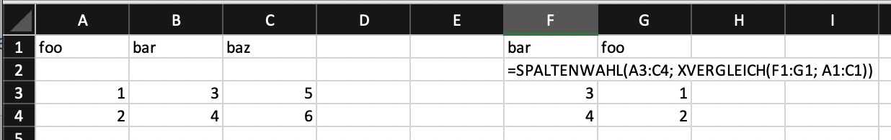

# Aussagenlogik {#sec-chapter-boolsche-operationen}

## Wahrheitswerte in Excel 

Wie im Kapitel Datentypen bereits erwähnt, kennt Excel den Datentyp der Wahrheitswerte. Diese Wahrheitswerte können entweder den Wert `WAHR` oder `FALSCH` haben. Eine Operation, die Wahrheitswerte ergibt wird als *logischer Ausdruck* bezeichnet. Weil logische Ausdrücke für viele Funktionen und Operationen notwendig sind, wandelt Excel die Werte anderer Datentypen bei Bedarf um. Dabei gelten die folgenden Regeln: 

- `0` und die *leere Zelle* entspricht dem Wert `FALSCH`.
- Alle Zahlen ungleich `0` entstprechen dem Wert `WAHR`.
- Alle Zeichenketten inklusive der *leeren Zeichenkette* entsprechen dem Wert `WAHR`.
- Fehlerwerte bleiben unverändert.

Werden Wahrheitswerte in mathematischen Operationen und Funktionen verwendet, dann konvertiert Excel den Wert `FALSCH` in `0` und den Wert `WAHR` in `1` um. 

Werden Wahrheitswerte als Parameter an Zeichenkettenfunktionen übergeben, dann werden die Wahrheitswerte in die entsprechende Zeichenkette umgewandelt. Aus dem Wert `WAHR` wird also die Zeichenkette `"WAHR"` und aus dem Wert `FALSCH` wird die Zeichenkette `"FALSCH"`. 

::: {.callout-warning} 
Wahrheitswerte werden in den verschiedenen Sprachversionen von Excel in der eingestellten Sprache angegeben. Beim Wechsel zwischen verschiedenen Excel-Sprachversionen werden die Wahrheitswerte automatisch korrekt angezeigt. Die Umwandlung in Zeichenketten erfolgt dann in der jeweiligen Sprache. Deshalb sollte die Verwendung von in Zeichenketten konvertierten Wahrheitswerten in nachgelagerten Funktionen vermieden werden.
:::

## Aussagenlogische Operationen

Für Wahrheitswerte existieren spezielle Operationen, um die Regeln der *Aussagenlogik* bzw. der *Boole'schen Algebra* abzubilden. Diese Operationen verknüpfen Wahrheitswerte und haben Wahrheitswerte als Ergebnis. Die vier Grundoperationen `NICHT` ($\lnot$), `UND` ($\land$), `ODER` ($\lor$, "inklusives Oder") und `XODER` ($\oplus$, "entweder-oder") sind in Excel als Funktionen verfügbar.

Die Funktion `NICHT()` wandelt einen Wert in den jeweils den anderen Wahrheitswert um. Falls anstelle eines Wahrheitswerts ein anderer Datentyp übergeben wurde, gelten die oben angegebenen Regeln für die Umwandlung. 

Die Funktionen `UND()`, `ODER()` und `XODER()` sind *Aggregatoren*. Das bedeutet, dass Sie alle Werte in dem angegebenen Bereichen zusammenfassen. Das ist oft nicht das gewünschte Verhalten. Deshalb muss bei der Arbeit mit Vektoren auf die Bool'sche Arithmetik zurückgegriffen werden, um logische Ausdrücke richtig auszuwerten.

Zum Beispiel sollen für die folgenden Werte *paarweise* der logische Ausdruck $a \land b$ ausgewertet werden, so dass für alle Wertepaare der richtige Wahrheitswert ermittelt wird.

|   A |   B |
|:----:|:----:|
| `WAHR` | `FALSCH` |
| `FALSCH` | `WAHR` |
| `WAHR` | `WAHR` |
| `FALSCH` | `WAHR` |
| `WAHR` | `WAHR` |
| `FALSCH` | `FALSCH` |

Die Formel `= UND(A1:A6; B1:B6)` liefert den Wert `FALSCH` zurück, weil nicht alle Werte im *gesamten Bereich* von `A1:A6` und `B1:B6` gleich `WAHR` sind. Es gibt keine Funktion und keinen eigenen logischen Operator zur paarweisen logischen Verknüpfung dieser beiden Bereiche. Deshalb werden in Excel oft logische Ausdrücke in der Boole'schen Arithmethik eingesetzt, um nur die Werte aus den gleichen Datensätzen miteinander zu vergleichen. Diese Schreibweise ist immer dann notwendig, wenn logische Ausdrücke sich auf die einzelnen Datensätze beziehen.

Die Formel `= A1:A6 * B1:B6` hat die Werte `{0;0;1;0;1;0}` zum Ergebnis. Um Wahrheitswerte zuerhalten kann noch auf die Ungleichheit mit `0` geprüft werden. Dazu wird die Formel wie folgt ergänzt: `= (A1:A6 * B1:B6) <> 0`. Das Ergebnis ist nun `{FALSCH; FALSCH; WAHR; FALSCH; WAHR; FALSCH}`. Dieser Schritt ist in der Praxis selten notwendig, weil für die meisten Operationen Zahlenwerte implizit als Wahrheitswerte behandelt werden. 

Weil Excel alle Werte ungleich `0` als `WAHR` interpretiert, können die Operationen `UND()` mit `*` und die Operation `ODER()` mit `+` direkt ersetzt werden. Hierbei ist darauf zu achten, dass das nummerische Ergebnis dieser Addition oder Multiplikation *ausschliesslich* als Wahrheitswert von Bedeutung ist. 

Die Operation `XODER()` entspricht der Ungleichheit `<>`. Dabei muss allerdings darauf geachtet werden, das dieser Vergleich als Ersatz für `XODER()` *ausschliesslich* für Wahrheitswerte bzw. `0` und `1` erlaubt ist. Für die oben gezeigten Werte ergibt die Formel `= (A1:A5 <> B1:B5)` die Werte `{WAHR; WAHR; FALSCH; WAHR; FALSCH; FALSCH}`. Das Ergebnis ist deshalb sichergestellt, weil alle Vergleichswerte `0` oder `1` sind. Werden jedoch auch andere Vergleichswerte zugelassen, dann liefert die Formel `= (A1:A6 <> B1:B6)` die Werte `{WAHR; WAHR; WAHR; WAHR; WAHR; WAHR}`. Dieses Verhalten zeigt das folgende Beispiel.

|   A |   B |
|:----:|:----:|
| `1` | `0` |
| `0` | `2` |
| `1` | `2` |
| `0` | `1` |
| `3` | `2` |
| `0` | `0` |

Damit das Richtige Ergebnis erzeugt wird, müssen die Werte in Wahrheitswerte konvertiert werden. Dazu muss die Formel durch Vergleiche ungleich `0` erweitert werden: 

```
= (A1:A6 <> 0) <> (B1:B6 <> 0)
``` 

Diese Formel liefert die gewünschten Werte `{WAHR; WAHR; FALSCH; WAHR; FALSCH; FALSCH}`.

Die folgende Tabelle zeigt logischen Operatoren und die zugehörigen Terme für die Boole'sche Arithmetik.

| Operator | Boole'sche Operation | Vereinfachter Operator |
| :---: | :---: | :---: | 
| $\lnot$ | `1 - a` | `NICHT(a)` |
| $\land$ | `a * b` | `a * b` |
| $\lor$ | `a + b - a * b` | `a + b` |
| $\oplus$ | `a + b - 2 * a * b` oder `( a - b ) ^ 2` | `(a <> b)` |`

## Vergleiche

Eine besondere Art von logischen Ausdrücken sind *Vergleiche*. Ein Vergleich prüft das Verhältnis zweier Werte zueinander. Excel kennt die üblichen Vergleichsoperatoren, die jeweils einen Wahrheitswert zurückliefern.

In Excel werden die Vergleichsoperatoren wie folgt geschrieben: 

- `>` (grösser als)
- `<` (kleiner als)
- `>=` (grösser oder gleich)
- `<=` (kleiner oder gleich)
- `=` (gleich)
- `<>` (ungleich) 

Excel's Vergleichsoperatoren sind Datentypen sensitiv. Das bedeutet, dass die Operatoren Datentypen vor dem Vergleich *nicht* angleichen. Der folgende Vergleich ergibt also `FALSCH`.

```
= 3 = "3"
```

::: {.callout-note}
## Merke
Ziffern sind keine Zahlen!
:::


Weil die Operationen `*`, `+` und `-` normalerweise vor den Vergleichsoperatoren ausgeführt werden, müssen alle Vergleiche eines logischen Ausdrucks für die Boole'sche Arithmetik in Klammern gesetzt werden.

### Der $\in$-Operator mit XVERWEIS

Mithilfe der Funktion `XVERGLEICH()` kann der $\in$-Operator aus der *Mengenlehre* in Excel für logische Ausdrücke bereitgestellt werden. Mit dieser Funktion `XVERWEIS()` können sowohl der $\in$ als auch der $\notin$-Operator mit `XVERWEIS()` abgebildet werden.

Für die folgenden Beispiele verwenden wir die Werte:

|       A       |      B      |
|:-------------:|:-----------:|
| Suchkriterium | Suchbereich |
|       `4`       |      `1`      |
|       `7`       |      `3`      |
|               |      `4`      |
|               |      `8`      |

-   $\in$-Operator: `XVERWEIS(A2:A3; B2:B5; B2:B5 = B2:B5; FALSCH)`
-   $\notin$-Operator: `XVERWEIS(A2:A3; B2:B5; B2:B5 <> B2:B5; WAHR)`

Der Trick besteht darin, dass die *Rückgabematrix* durch einen Vergleich aus dem Suchbereich erzeugt wird. Dadurch wird die Rückgabematrix mit den gleichen Wahrheitswerten für alle Werte im Suchbereich gefüllt. Die erste Formel ergibt deshalb `{WAHR; FALSCH}` und die zweite Formel `{FALSCH; WAHR}`, weil der Wert `4` im Suchbereich vorkommt und der Wert `7` nicht. Diese Werte können direkt in logischen Ausdrücken verwendet werden.

### Zeichenketten vergleichen

Die Vergleichsoperatoren zeigen die Unterschiede zweier Zeichenketten bezüglich der alphabetischen Sortierung an. Die "kleinste" Zeichenkette ist die leere Zeichenkette. Gross- und Kleinschreibung wird bei Zeichenkettenvergleichen nicht unterschieden.

Weil Excel für Vergleiche die nicht-druckbaren Zeichen mit Ausnahme des Leerzeichens und des Tabulators ignoriert, gibt der Vergleichsoperator `=` `WAHR` auch für Zeichenketten zurück, die unterschiedliche nicht-druckbare Zeichen enthalten. Das gleiche Problem entsteht beim Vergleich von unterschiedlicher Gross- und Kleinschreibung. Um auch diese Unterschiede zu erkennen, müssen wir die Funktion `IDENTISCH()` verwenden. Diese Funktion vergleicht die Zeichenketten Zeichen für Zeichen und liefert nur dann `WAHR` zurück, wenn die Zeichenketten exakt gleich sind.

BEISPIEL

## Komplexe logische Ausdrücke und Datenstrukturen {#sec-vector-logic}

Excel hat zwar Funktionen für die logischen Operatoren *Und* (`UND()`), Oder (`ODER()`) und *Exklusives Oder* (`XODER()`), diese Funktionen haben aber den Nachteil, dass sie nur Werte zusammenfassen können. In der Praxis werden jedoch oft *Datenstrukturen* als Variablen für logische Ausdrücke verwendet. Diese sollen durch die logischen Operatoren verknüpft und nicht zusammengefasst werden.

Um logische Verknüfungen für Datenstrukturen zu realisieren, müssen die logischen Operatoren mit der Boole'schen Arithmetik umgesetzt werden. Dazu werden die logischen Operatoren durch die entsprechenden arithmetischen Operatoren ersetzt.

> ::: {#exm-vector-logic}
>
>Für die folgenden Werte soll der folgende logische Ausdruck geprüft werden.
>
> $$
> a \land b \lor (c < 10) \land d
> $$
>
> |   A |   B |   C |   D |
> |:----:|----:|----:|----:|
> | WAHR | 5 | 21 | 17 |
> | FALSCH | 3 | 5 | 1 |
> | WAHR | 0 | 10 | 2 |
> | FALSCH | 1 | 11 | 3 |
> 
> Für diesen Ausdruck werden die Werte `{WAHR; WAHR; FALSCH; FALSCH}` erwartet.
> 
> Die naive Umsetzung `=ODER(UND(A1:A4;B1:B4);UND(C1:C4;D1:D4))` hat als Ergebnis den Wert `WAHR`. 
> 
> Die Formel `= A1:A4 * B1:B4 + (C1:C4 < 10) * D1:D4` liefert die Werte `{5; 1; 0; 0}` diese lassen sich durch einen Vergleich in die entsprechenden Wahrheitswerte konvertieren. Diese Konversion ist nur notwendig, wenn der Ausdruck nicht als logischer Ausdruck an eine Funktion übergeben wird.
> 
> ```
> = (A1:A4 * B1:B4 + (C1:C4 < 10) * D1:D4) <> 0
> ```
> 
> Diese Formel ergibt die erwarteten Werte `{WAHR; WAHR; FALSCH; FALSCH}`.
> ::: 

Die Ausnahme von dieser Regel ist Verwendung der logischen Funktionen als Tabellenfunktion. In diesem Fall können die Werte zeilenweise auch von den logischen Funktionen verarbeitet werden.

> ::: {#exm-table-logic}
> 
> Werden die Werte aus @exm-vector-logic als Tabelle konvertiert und mit `BeispielTabelle` benannt, dann können die logischen Funktionen in einer *gleich langen Tabelle* mit der *gleichen Startzeile* auch als Tabellenfunktionen verwendet werden. In diesem Fall werden die Werte zeilenweise verarbeitet.
> 
> ```
> =ODER(
>       UND(BeispielTabelle[@a];BeispielTabelle[@b]);
>       UND(BeispielTabelle[@c] < 10; BeispielTabelle[@d])
>  )
> ```
> 
> Diese Formel ergibt die erwarteten Werte `{WAHR; WAHR; FALSCH; FALSCH}`.
> :::


## Fälle unterscheiden

Logische Ausdrücke eigenen sich besonders gut, um *Fallunterscheidungen* zu formulieren, weil ein logischer Ausdruck immer nur zwei Werte als Ergebnis haben kann. Es gibt also für jeden logischen Ausdruck immer nur zwei unterscheidbare Fälle.

Excel hat zwei zentrale Funktionen für Fallunterscheidungen: `WENN()` und `WENNS()`. Die Funktion `WENN()` ist eine *einfache* Unterscheidung, die Funktion `WENNS()` unterstützt *mehrfache* Unterscheidungen. In anderen Programmiersprachen wird in diesem Zusammenhang auch von *Verzweigungen* gesprochen. 

### WENN

Die Funktion `WENN()` ist eine *einfache* Fallunterscheidung. Einfach bedeutet hier, dass die beiden Fälles *eines* logischen Ausdrucks unterschieden werden. Entsprechend hat die Funktion `WENN()` drei Parameter:

1. Der auszuwertende logische Ausdruck.
2. Das Ergebnis falls der logische Ausdruck `WAHR` ergibt.
3. Das Ergebnis falls der logische Ausdruck `FALSCH` ergibt.

Das Ergebnis für den Fall, dass der logische Ausdruck `FALSCH` ergibt, ist optional. Fehlt dieser Parameter, dann wird der Wert `FALSCH` zurückgegeben.

Das Verhalten dieser Funktion lässt sich mit den Wahrheitswerten als logischer Ausdruck direkt überprüfen: 

``` 
= WENN(WAHR; "Guten Tag"; "Auf Wiedersehen")
```

Weil der logische Ausdruck in diesem Fall `WAHR` ist, wird der zweite Parameter als Ergebnis zurückgegeben. Die Formel gibt also den Wert `"Guten Tag"` zurück.  

Wird der logische Ausdruck auf `FALSCH` geändert, dann liefert die Formel den Wert `"Auf Wiedersehen"`.

```
= WENN(FALSCH; "Guten Tag"; "Auf Wiedersehen")
```

Lassen wir den dritten Parameter weg, dann wird der Wert `FALSCH` zurückgegeben.

```
= WENN(FALSCH; "Guten Tag")
```

Ausser der Fallunterscheidung hat `WENN()` keine weiteren Eigenschaften. Deshalb wird diese Funktion in der Praxis oft mit anderen Funktionen kombiniert. Das kann mit der Funktion `WENN()` selbst geschehen. In diesem Fall wird von geschachtelten Fallunterscheidungen gesprochen.

Zur Veranschaulichung dient das folgende Beispiel:

||   A |
|----:|:----:|
|1|  `4` |
|2| `7` |

Eine Fallunterscheidung soll prüfen, ob die Werte in `A1:A2` Werte gleich `1`, `3`, `4` oder `8` sind. Falls das der Fall ist, soll der zugehörige Zahlwert als Zeichenkette ausgegeben werden. Falls das nicht der Fall ist, soll der Wert `Ungültig` zurückgegeben werden.  Als geschachtelte `WENN()`-Funktion lässt sich diese Fallunterscheidung wie folgt formulieren:

```
= WENN(A1 = 1; "Eins"; 
       WENN(A1 = 3; "Drei"; 
            WENN(A1 = 4; "Vier"; 
                 WENN(A1 = 8; "Acht"; 
                      "Ungültig"))))
```

Eine solche geschachtelte Fallunterscheidung wird als *Entscheidungsbaum* bezeichnet.

### WENNS

Die Funktion `WENN()` ist eine *einfache* Fallunterscheidung. In vielen Excel-Arbeitsmappen existieren geschachtelte Aufrufe von `WENN()`-Funktionen. Diese Aufrufe machen die Formeln nicht nur schwer lesbar, sondern auch fehleranfällig und ineffizient. Deshalb sollten geschachtelte Fallunterscheidungen unbedingt vermieden werden. Mit der Funktion `WENNS()` lassen sich geschachtelte Fallunterscheidungen vermeiden, indem alle Fallunterscheidungen in einem einzigen Funktionsaufruf zusammengefasst werden. 

> **Merke:** geschachtelte Fallunterscheidungen mit `WENN()` unbedingt vermeiden!

Die Funktion `WENNS()` erwartet Parameterpaare, bestehend aus einem logischen Ausdruck und dem Ergebnis, falls dieser logische Ausdruck `WAHR` ergibt. Die Funktion kann bis zu 127 Parameterpaare verarbeiten, so dass sich auch sehr komplexe Fallunterscheidungen mit dieser Funktion abbilden lassen.

(*Beispiel 1*) Das folgende Beispiel zeigt die Verwendung der Funktion `WENNS()` für die geschachtelte Fallunterscheidung aus dem Abschnitt `WENN`.

```
= WENNS(A2:A3 = 1; "Eins"; 
        A2:A3 = 3; "Drei"; 
        A2:A3 = 4; "Vier"; 
        A2:A3 = 8; "Acht")
```

Das Beispiel bildet aber noch nicht die vollständige Fallunterscheidung ab. Es fehlt noch der Fall, dass keiner der logischen Ausdrücke `WAHR` ergibt. Leider kann `WENNS()` ausschliesslich logische Ausdrücke mit ihren Ergebnissen verbinden. 

> **Merke:** `WENNS()` kann nur logische Ausdrücke mit ihren `WAHR`-Ergebnissen verbinden.

Anders als bei `WENN()` gibt es keine direkte Möglichkeit, ein Ergebnis festzulegen, falls alle logische Ausdrücke `FALSCH` ergeben. Um ein solches Verhalten zu erzeugen, wird ausgenutzt, dass die Funktion `WENNS()` immer einen wahren logischen Ausdruck mit einem Ergebnis verknüpft. Weil die logischen Ausdrücke in der Reihenfolge ausgewertet werden, wie sie in der Funktion angegeben sind, muss der letzte logische Ausdruck alle Fälle abdecken, die von keinem anderen der vorangegangen logischen Ausdrücke akzeptiert wurden. Der einfachste logische Ausdruck, der immer wahr ist, ist der Wahrheitswert `WAHR`. Deshalb wird dieser Wert als letzter logischer Ausdruck für `WENNS()` verwendet.

Mit diesem Wissen lässt sich das erste Beispiel mit `WENNS()` vervollständigen:

```
= WENNS(A2:A3 = 1; "Eins"; 
        A2:A3 = 3; "Drei"; 
        A2:A3 = 4; "Vier"; 
        A2:A3 = 8; "Acht"; 
        WAHR; "Ungültig")
```

Diese Formel prüft die Werte in `A2:A3` auf Gleichheit mit den Werten `1`, `3`, `4` und `8`. Für diese Zahlen wird die zugehörige Zahlwert als Zeichenkette ausgegeben. Falls keiner dieser Werte gefunden wird, wird der Wert `Ungültig` zurückgegeben. 

Die Fallunterscheidung mit `WENNS()` endet beim ersten logischen Ausdruck, der `WAHR` ergibt. Die Funktion prüft der Reihe nach alle angegebenen logischen Ausdrücke. Sobald einer dieser Ausdrücke `WAHR` ist, wird der zugehörige Ergebniswert ausgegeben und die Funktion wird beendet. Diese Eigenschaft begründet, dass die logischen Ausdrück nur die Fälle prüfen müssen, die von den vorangegangenen logischen Ausdrücken nicht abgedeckt wurden.

(*Beispiel 2) Das folgende komplexe Beispiel zeigt, wie die Fallunterscheidung mit `WENNS()` vereinfacht werden kann.

```
WENN(J2>=O2;
    (WENN(J2>L2;
          0;
          WENN(J2<=L2;
               WENN((J2>N2)*(J2>=O2);
                    (K2+((M2-K2)/(N2-L2))*(J2-L2));
                    WENN((J2<=N2)*(J2<O2);
                         (M2+((O2-M2)/(O2-N2))*(J2-N2))
                ))
          )
    ));
    100)
```

Diese Formel ist aus zwei Gründen übermässig komplex.

1. Die Fallunterscheidung mit `WENN()` ist geschachtelt.
2. Es existieren *redundante* Fallunterscheidungen. 

Bevor die Fallunterscheidung mit `WENNS()` vereinfacht wird, werden die redundanten Fallunterscheidungen entfernt. Das betrifft die zweite (`J2 > L2`) und die vierte Fallunterscheidung (`J2 > N2`). Im jeweiligen `FALSCH`-Fall wird der gegenteilige logische Ausdruck geprüft. Das ist in diesem Fall unnötig, weil die äussere Fallunterscheidung diesen Fall bereits abdeckt. Werden die redundanten logischen Ausdrücke und unnötige Klammern entfernt, dann ergibt sich die folgende wesentlich einfachere Formel.

```
= WENN(J2>=O2;
    WENN(J2>L2;
          0;
          WENN((J2>N2)*(J2>=O2);
              K2+(M2-K2)/(N2-L2)*(J2-L2);
              M2+(O2-M2)/(O2-N2)*(J2-N2)
          )
    );
    100)
```

Die äusserste Fallunterscheidung hat für den Fall `WAHR` eine geschachtelte `WENN()`-Funktion und im Fall `FALSCH` ein einfaches Ergebnis. Das ist für `WENNS()` unhandlich, so dass die äusserste Fallunterscheidung durch Umkehrung des logischen Ausdrucks umgestellt wird. 

```
= WENN(J2<O2;
       100; 
       WENN(J2>L2;
            0;
            WENN((J2>N2)*(J2>=O2);
                 K2+(M2-K2)/(N2-L2)*(J2-L2);
                 M2+(O2-M2)/(O2-N2)*(J2-N2)
            )
       )
  )
```

Nun lassen sich die vier unterschiedlichen Fälle gut erkennen und mit `WENNS()` abbilden. Daraus ergibt sich die folgende Formel.

```
= WENNS(J2<O2; 100; 
        J2>L2; 0; 
        (J2>N2)*(J2>=O2); K2+(M2-K2)/(N2-L2)*(J2-L2); 
        WAHR; M2+(O2-M2)/(O2-N2)*(J2-N2)
  )
```

Diese Formel ist wesentlich einfacher zu lesen und zu verstehen. Beim Durchgehen der Fälle fällt auf, dass ein Teilausdruck des dritten Falls das Gegenteil des ersten Falls ist. Diese Bedingung wurde bereits im ersten Fall geprüft und würde sie nicht gelten, dann wäre die Formel bereits beendet worden. Deshalb können bereits geprüfte Teilausdrücke in den nachfolgenden Ausdrücken weggefallen. Dadurch wird nicht nur die Verschachtelung, sondern auch die Komplexität der logischen Ausdrücke vereinfacht.

```
= WENNS(J2<O2; 100; 
        J2>L2; 0; 
        J2>N2; K2+(M2-K2)/(N2-L2)*(J2-L2); 
        WAHR;  M2+(O2-M2)/(O2-N2)*(J2-N2)
  )
```

Diese Formel hat jedoch den Makel, dass der letzte Fall `WAHR` keine Konstante abbildet. Besser wäre es, wenn der zweite und der letzte Fall vertauscht wären, so dass der Wert `0` der letzte Wert ist. Dazu müssen die logischen Ausdrücke umorganisiert werden. Bei der Umorganisation ist die Reihenfolge der logischen Ausdrücke zu beachten: Die letzten beiden Fälle sind nicht umabhängig vom logischen Ausdruck `J2>L2`. Beim Umorganisieren darf diese Abhängigkeit nicht verloren gehen.

```
= WENNS(J2<O2; 100; 
        (J2<=L2)*(J2>N2); K2+(M2-K2)/(N2-L2)*(J2-L2); 
        J2<=L2; M2+(O2-M2)/(O2-N2)*(J2-N2)
        WAHR; 0
  )
```

Diese Formel ist deutlich einfacher und weniger Fehleranfällig als die ursprüngliche Formel mit geschachtelten `WENN()`-Funktionen. Es lassen sich auch weitere Fälle hinzufügen, ohne dass die Formel komplexer wird. Dabei ist zu beachten, dass diese Fälle *vor* dem Fall `WAHR` angegeben werden müssen.

### Nicht erreichbare Entscheidungen

Ein besonderes Problem sind Entscheidungen, die zwar definiert aber nie erreicht werden können. Solche Entscheidungen sind immer *redundant*. Eine nicht erreichbare Entscheidung kann nur dann auftreten, wenn eine vorangegangene Entscheidung bereits den geprüften Fall abdeckt. Ergibt ein solcher logischer Ausdruck `Falsch`, dann wird eine spätere Entscheidung für den gleichen Fall im Falsch-Zweig des Entscheidungsbaums ebenfalls `Falsch` ergeben. Der Wahr-Zweig dieser Entscheidung kann damit nie erreicht werden. 

::: {#exm-wenns-nicht-erreichbar}
## Nicht erreichbare Entscheidung

```
=WENNS( A1 > 5; "Sehr gut"; 
        A1 > 3; "Genügend"; 
        A1 > 4; "Gut"; 
        A1 <= 3; "Ungenügend")
```
:::

In @exm-wenns-nicht-erreichbar kann nie das Ergebnis "Gut" erzeugt werden, weil der zweite logische Ausdruck (A1 > 3) alle Werte "maskiert", die durch den dritten logischen Ausdruck (A1 > 4) als "Gut" markiert werden müssten. "Ungenügend" würde trotzdem angezeigt werden, wenn der Wert in A1 entweder 1, 2 oder 3 ist.

::: {.callout-important}
Eine nicht erreichbare Entscheidung ist kein technischer Fehler, sondern ein logischer Fehler.
::: 

Im @exm-wenns-nicht-erreichbar kann die Entscheidung `A1 > 4` nicht erreicht werden, weil das vorherige und allgemeinere Kriterium `A1 > 3` für die gleichen Werte zutrifft.  

::: {.callout-note}
## Merke
Es müssen immer die spezielleren Kriterien vor den allgemeineren Kriterien geprüft werden.
:::

Nicht erreichbare Entscheidungen lassen sich durch das Formale prüfen der logischen Ausdrücke leicht erkennen. Dazu werden logischen Ausdrücke und die zugehörigen Wertebereiche für den Wahr- und Falsch-Fall untereinander aufgeschrieben. Ein logischer Ausdruck kann einen Wertebereich nur dann abdecken, wenn dieser eine Teilmenge des Wertebereichs der aktuellen logischen Verzweigung ist.

|Rang | logischer Ausdruck | Wahr-Fall | Falsch-Fall |
|:----:|:------------------:|:---------:|:-----------:|
| 1 | `A1 > 5` | `A1 > 5` | `A1 <= 5` |
| 2 | `A1 > 3` | `A1 > 3` | `A1 <= 3` |
| 3 | `A1 > 4` | `A1 > 4` | `A1 <= 4` |
| 4 | `A1 <= 3` | `A1 <= 3` | `A1 > 3` |

: Formale Prüfung der logischen Ausdrücke aus @exm-wenns-nicht-erreichbar {#tbl-wenns-nicht-erreichbar}

Weil die Funktion `WENNS()` verwendet wird, ist der Wertebereich für einen logischen Ausdruck durch die Falsch-Fälle der logischen Ausdrücke mit niedrigerem Rang abgedeckt. 

Für Rang 3 muss wegen dieser Tabelle der logischen Ausdruck in @eq-nichterreichbar gelten. Dieser Ausdruck kann jedoch nie Wahr ergeben, weil der geiche Wert in Variable $A1$ nicht kleiner oder gleich 3 und gleichzeitig grösser als 4 sein kann.

$$
\begin{aligned}
& (A1 <= 5) \land & (A1 <= 3) \land & (A1 > 4) \\
\Leftrightarrow & & (A1 <= 3) \land & (A1 > 4) \\
\Leftrightarrow &  & \text{Falsch}
\end{aligned}
$$ {#eq-nichterreichbar}


### ERSTERWERT

Die Funktion `ERSTERWERT()` bildet einen Spezialfall von `WENNS()` ab: Es wird bei allen logischen Ausdrücken ein Vergleich auf Gleichheit des *Suchkriteriums* mit verschiedenen Referenzwerten durchgeführt. In diesem Fall können die logischen Ausdrücke mit `ERSTERWERT()` stark vereinfacht werden. Das lässt sich am ersten Beispiel im Abschnitt `WENNS` veranschaulichen.  

Weil alle logischen Ausdrücke die Gleichheit über den gleichen Adressbereich prüfen, kann die Operation mit der Funktion `ERSTERWERT()` vereinfacht wie folgt werden.

```
= ERSTERWERT(A2:A3; 
             1; "Eins"; 
             3; "Drei"; 
             4; "Vier"; 
             8; "Acht"; 
             "Ungültig")
```

### XVERWEIS zur Fallunterscheidung

Die Funktion `XVERWEIS()` ist als Excels Version des $\in$-Operators bereits bekannt. Die Funktion kann auch als Alternative zur Funktion `ERSTERWERT()` verwendet werden. In diesem Fall werden als Rückgabematrix keine Wahrheitswerte, sondern die Ergebnisse der Fallunterscheidung angegeben. 

Der Vorteil dieser Anwendung ist, dass die Fallunterscheidung nicht mehr auf die Anzahl der Parameterpaare beschränkt ist und die Parameterpaare zum Zeitpunkt der Formelerstellung auch nicht bekannt sein müssen. 

Das folgende Beispiel zeigt die Umsetzung des Beispiels aus dem Abschnitt `ERSTERWERT` mit `XVERWEIS()`. Dazu wird zuerst eine Tabelle mit den Vergleichswerten und den zugehörigen Ergebnissen erstellt.

|   C |   D |
|:----:|:----:|
| `1` | `Eins` |
| `3` | `Drei` |
| `4` | `Vier` |
| `8` | `Acht` |

Diese Referenztabelle stell in Spalte `C` die sog. Suchmatrix und in Spalte `D` die sog. Rückgabematrix bereit. Mit diesen Werten lässt sich die Fallunterscheidung wie folgt abbilden.

```
= XVERWEIS(A2:A3; C2:D5; D2:D5; "Ungültig")
```

Ein weiterer Vorteil von `XVERGLEICH()` gegenüber `ERSTERWERT()` sind Vergleiche mit den Operatoren `=`, `<=` oder `>=`. Diese Vergleiche lassen sich über den fünften Parameter von `XVERWEIS()` konfigurieren. Dabei steht der Wert `0` für die Gleichheit, der Wert `-1` für kleiner oder gleich und der Wert `1` für grösser oder gleich. Die Vergleiche sind immer so organisiert, dass der linke Operand dem Suchkriterium entspricht und der rechte Operand dem Wert in der Suchmatrix. Bei einem Treffer wird der Wert aus der Rückgabematrix zurückgegeben. Gibt es keinen Treffer für den Vergleich wird der Wert aus dem vierten Parameter `wenn_nicht_gefunden` geliefert.

### Anwendungshilfe für Fallunterscheidungen

Die Anwendung der verschiedenen Fallunterscheidungsfunktionen hängt von verschiedenen Kriterien ab. Diese sind hier zusammengefasst: 

Die Funktion `WENN()` wird immer dann eingesetzt, wenn ein logischer Ausdruck geprüft werden muss und nur die beiden Fälle dieses Ausdrucks unterschieden werden müssen.

Die Funktion `WENNS()` wird immer dann eingesetzt werden, wenn mehrere logische Ausdrücke geprüft werden müssen. Die logischen Ausdrücke können dabei beliebig komplex sein und sich auf verschiedene Daten und Bereiche beziehen.

Die Funktion `ERSTERWERT()` wird immer dann eingesetzt, wenn die Gleichheit des Suchkriteriums mit wenigen Referenzwerten überprüft werden soll. Die Suchkriterien sind für alle Vergleiche identisch. 

Die Funktion `XVERWEIS()` wird immer dann eingesetzt, wenn ein Vergleich auf Gleichheit, Kleiner-oder-Gleich oder Grösser-oder-Gleich durchgeführt werden muss. Die Suchkriterien und die Vergleichsoperatoren sind für alle Vergleiche identisch.

Die Funktion `XVERWEIS()` muss anstatt von `ERSTERWERT()` verwendet werden, wenn die Referenzwerte des Vergleichs zum Zeitpunkt der Formelerstellung noch nicht bekannt sind oder leicht änderbar bleiben sollen.

## Filtern

Excel bietet die Funktion `FILTER()` zum Filtern von Daten. Diese Funktion erzeugt einen Ergebnisbereich mit den Werten, die durch den angegebenen logischen Ausdruck ausgewählt wurden. 

::: {.callout-warning}
In Excel können in Tabellen und Pivot-Tabellen für einzelne Vektoren Werte für die *Darstellung* "gefiltert" werden. Dabei verwendet Excel nicht die Filter Funktion, sondern *blendet* einzelne Datensätze *aus*. Dadurch können die Ergebnisse  nachgereihter Operationen nicht mit den dargestellten Werten zusammenpassen, weil nicht-dargestellte Werte weiterhin Teil der Daten sind und bei Berechnungen weiterhin mitberücksichtigt werden.
:::

Das Ergebnis der Funktion `FILTER()` ist ein dynamischer Bereich mit den ausgewählten Werten. Im Gegensatz zu Tabellen-Filter sind die nicht dargestellten Werte nicht mehr Teil der Daten. Deshalb sind die Ergebnisse der `FILTER()`-Funktion konsistent mit den Ergebnissen der nachgereihten Operationen.

::: {#def-excel-filter}
Excels `FILTER()`-Funktion wählt aus einem Vektor die Werte aus, für die ein **Auswahlvektor** den Wert `WAHR` oder einen Wert, der dem logischen `WAHR` entspricht. 
:::

> ::: {#exm-excel-filter}
> ## Filtern mit Excel
> 
> Gegeben sind die folgende Werte in den Spalten `A` und `B`. Die `Filter()`-Funktion steht an Adresse `D2`.
> 
> | | A | B | C | D |
> | :---: | :---| :---: |  :---: | :---: | 
> | **1** | Basel | WAHR | | `=FILTER(A1:A5; B1:B5)` | 
> | **2** | Genf | FALSCH | | Basel | 
> | **3** | Lugano | FALSCH | | Zug | 
> | **4** | Zug | WAHR | | Zürich | 
> | **5** | Zürich | WAHR | | | 
> 
> Weil die Werte in Spalte `B` vom Datentyp Wahrheitswert sind, kann > dieser Vektor zur Auswahl der Städtenamen in Spalte `A` verwendet werden.
> 
> Anstelle eines Vektors mit Wahrheitswerten wird meistens ein Vergleich als zweiter Parameter übergeben. Dieser Vergleich muss einen Vektor erzeugen, der genauso lang ist, wie der Vektor im ersten Parameter. Solche Vektoren werden dynamisch erzeugt, indem ein Vergleich entweder den Vektor selbst oder einen benachbarten Vektor verwendet.
> 
> | | A | B | C | D |
> | :---: | :---| :---: |  :---: | :---: |
> | **1** | Basel | deutsch | | `=FILTER(A1:A5; B1:B5 = "deutsch")` | 
> | **2** | Genf | französisch | | Basel | 
> | **3** | Lugano | italienisch | | Zug | 
> | **4** | Zug | deutsch | | Zürich | 
> | **5** | Zürich | deutsch | | | 
> :::

### Excel Filter und logische Operationen

Weil die `FILTER()`-Funktion immer über Vektoren arbeitet, können die logischen Funktionen nicht verwendet werden, weil sie keine Vektoren erzeugen. Deshalb *muss* der logische Ausdruck des Filters als Boole'sche Arithmetik formuliert werden (@sec-vector-logic).

::: {.callout-note}
Die Funktion `NICHT()` ist kein Aggregator und kann mit der `FILTER()`-Funktion kombiniert werden.
:::

Um mit komplexen logischen Ausdrücken in Filtern zu verwenden, müssen wir die logischen Operatoren durch ihre *arithmetische Schreibweise* ersetzen.

| | A | B | C | D | E |
| :---: | :---| :---: |  :---: | :---: | :---: |
| **1** | *Name* | *Sprache* | *Einwohner:innen* | | *Formel* |
| **2** | Basel | deutsch | 173863| | `=FILTER(A2:A6;(B2:B6="deutsch")*(C2:C6 > 100000))` | 
| **3** | Genf | französisch | 203856 | | Basel | 
| **4** | Lugano | italienisch | 62315 | | Zürich | 
| **5** | Zug | deutsch | 30934 | | | 
| **6** | Zürich | deutsch | 421878 | | | 
: Beispiel eines komplexen logischen Ausdrucks mit `FILTER()` {#tbl-filter-complex}

## Selektieren

Sehr häufig liegen umfangreiche Daten mit vielen Vektoren vor. Soll sich eine Analyse auf einzelne Vektoren beschränken, dann sollen, analog zum Filtern von Datensätzen, nur diese Vektoren ausgewählt werden. 

::: {#def-selektieren}
Das Filtern von Vektoren wird als **selektieren** bezeichnet. 
:::

Weil die Vektoren einer Stichprobe in der Regel benannt sind, werden Vektoren über ihre Namen *selektiert*. 

::: {.callout-note}
## Merke
Die Vektorennamen einer Stichprobe haben besondere Eigenschaften: 

1. Vektorennamen sind immer von Datentyp `Zeichenkette`.
2. Vektorennamen einer Stichprobe bilden einen **Vektor**.
3. Die Vektorennamen einer Stichprobe sind **eindeutig**
:::

Die dritte Eigenschaft ist nicht ganz offensichtlich, denn in einer manuell eingegebenen zwei-dimensionalen Struktur kann eine Überschrift mehrfach verwendet werden. Sobald eine solche Struktur in eine Excel-Tabelle umgewandelt wird, erzwingt Excel eindeutige Vektorennamen.

Aus diesen Eigenschaften folgt, dass die Auswahl von Vektoren durch die Eigenschaften von Zeichenketten unterstützt wird. Wir können zur Auswahl die folgenden Operationen verwenden: 

- Identischer Vektorname
- Vektorname beginnt mit einer bestimmten Zeichenkette
- Vektorname endet mit einer bestimmten Zeichenkette
- Vektorname enthält an einer beliebigen Position eine bestimme Zeichenkette

Diese Operationen lassen sich als logische Ausdrücke formulieren, wodurch sich komplexere Selektoren umsetzen lassen. 

Der einfachste Weg zum Vektoren adressieren ist die Verwendung des Vektornamens über die Tabellenadressierung. Dabei wird der Vektorname in eckige Klammern gesetzt (s. [Abschnitt @sec-tabellenadressen]). Die Tabellenadressierung ist jedoch auf vollständige Namen und auf zusammenhängende Bereiche beschränkt.

Die Verwendung einer Selektor-Funktion zur Auswahl von Vektoren ist nicht auf Tabellen beschränkt, sondern kann mit beliebigen tabellarischen Strukturen angewendet werden. In Excel wird eine Selektor Funktion durch die Funktionskette eines Filters mit der Funktion `SPALTENWAHL()` erreicht.

Neben der Tabellenadressierung bietet Excel die Funktion `SPALTENWAHL()`, um Vektoren aus einem Bereich auszulesen. Diese Funktion benötigt aber die Position der gewünschten Spalte, denn oft sollen aber  Vektoren über Namen oder Namensteile ausgewählt werden. Dafür kommt die Funktion `XVERGLEICH()` zur Anwendung. Mit `XVERGLEICH()` erhalten wir die Position eines gesuchten Werts in einem angegebenen Bereich. 

Die Idee hinter dem hier beschriebenen Ansatz ist, dass wir herausfinden, wo unser gewünschter Vektor in der Stichprobe steht. Anschliessend wählen wir alle Werte an dieser Position mit der Funktion `Spaltenwahl()` aus. 

::: {.callout-note}
Die Funktion `XVERGLEICH()` ähnelt der Funktion `XVERWEIS()` indem wir einen Wert in einem Vektor suchen können. Anstelle eines Referenzwerts aus einem anderen Vektor liefert `XVERGLEICH()` nur die Position des gesuchten Werts zurück. Falls ein Wert mehrfach vorkommt, dann gibt die Funktion nur die *erste* Position zurück. 
:::

Der Funktion `XVERGLEICH()` können mehrere Suchwerte übergeben werden, für welche die Positionen bestimmt werden. 




Der Algorithmus zum Selektieren von Vektoren ist durch die folgenden Schritte definiert: 

1. Wir *vektorisieren* nur die Vektornamen auf einem neuen Arbeitsblatt mit der Identitätsfunktion ab Adresse `B1`. Zur Veranschaulichung nenne ich dieses Arbeitsblatt `Stichprobendaten`. 
2. Wir *vektorisieren* *alle* Stichprobendaten mittels der Identitätsfunktion auf dem gleichen Arbeitsblatt ab Adresse `B2`. 
4. Auf einem neuen Arbeitsblatt geben wir in der ersten Zeile die Vektorennamen ab Adresse `A1` ein, die wir auswählen möchten. In diesem Beispiel wird angenommen, dass 3 Vektoren ausgewählt werden sollen.
5. Wir wählen die einzelnen Vektoren mit der folgenden Formel an der Adresse A2 aus.

::: {#exm-excel-selektion}
```
=SPALTENWAHL(Stichprobendaten!$B$2#; XVERGLEICH(A1:C1; Stichprobendaten!$B$1#))
``` 

Der Vorteil dieser Strategie ist, dass die Selektion individuelle, nicht-zusammenhängende Vektoren selektieren kann und nicht auf Tabellen beschränkt ist.

## Sortieren

Excel kennt zwei Funktionen zum Sortieren:

- `SORTIEREN()`
- `SORTIERENNACH()`

SORTIEREN NACH

Für allgemeine Sortierungen nach mehreren Vektoren stellt Excel die Funktion `SORTIERENNACH()` zur Verfügung.

::: {.callout-note}
**Excels `SORTIEREN()`-Funktion** kann einen Bereich zeilen- oder spaltenweise sortieren. Diese Funktion hat vier Parameter: 

-  `Matrix` - der zu sortierende Bereich, der *keine* Matrix sein muss.
- `Sortierindex` - die Spalten- oder Zeilennummer, nach der sortiert werden soll. Standardmässig wird die erste Spalte bzw. die erste Zeile angenommen. 
- `Sortierreihenfolge` - legt die Sortierreihenfolge fest. `1`, um aufsteigend und `-1`, um absteigend zu sortieren.
- `nach_Spalte` - Ein Wahrheitswert, ob die Spalten oder die Zeilen sortiert werden sollen. `WAHR` bedeutet, dass die Spalten (horizontal) sortiert werden sollen. `FALSCH` bedeutet, dass die Zeilen (vertikal) sortiert werden sollen. Standardmässig wird zeilenweise sortiert. 
:::

Die Funktion ermöglicht es, mehrere Vektoren auf einmal nach **mehreren** gemeinsamen Kriterien zu sortieren. Dazu müssen zuerst die Sortierkriterien identifiziert werden. 

#### Schritt 1: Sortierkriterien festlegen. 

Die Sortierkriterien sind durch die Werte im Sortierindex festgelegt, nach denen sortiert werden soll. Der Sortierindex ist ein Vektor mit einem Wert für eine Zeile bzw. Spalte der Sortiermatrix. Entlang der Werte im Sortierindex wird die Sortiermatrix sortiert. 

In Excel können die Vektoren mit den Sortierkriterien an einer beliebigen Position in einer Arbeitsmappe liegen. Dabei müssen zwei Bedingungen erfüllt sein: 

  1. Der Sortierindex und die Sortiermatrix müssen die gleiche Länge haben. 
  2. Die Sortierindex und die Sortiermatrix müssen die gleiche Orientierung haben. 

#### Schritt 2: 

Im zweiten Schritt werden die zu sortierenden Vektoren ausgewählt.

In R wird dieser zweite Schritt automatisch auf die vorgegebene Stichprobe angewandt. In Excel können wir zusammenhängende Vektoren als "Matrix" an die `SORTIERENNACH()`-Funktion übergeben. Hängen die Vektoren nicht direkt zusammen, dann müssen mehrere Sortieroperationen mit den gleichen Referenzen auf die Sortierreferenzen durchgeführt werden. 

In Excel wird die Sortierrichtung als `Sortierreihenfolge` bezeichnet und als separater Parameter für das jeweilige Sortierkriterium angegeben. Dabei steht `1` für die aufsteigende Sortierung und `-1` für die absteigende Sortierung. 


## Rezepte

### Fehlerwerte abfangen

Viele Excel-Funktionen geben einen Fehlerwert zurück, falls die Funktion kein gültiges Ergebnis ermitteln kann. Weil sich diese Fehlerwerte in Operationen fortpflanzen, müssen diese Werte durch einen geeigneten regulären Wert ersetzt werden. Das kann mit der folgenden Entscheidung erreicht werden. 

```
= WENN(ISTFEHLER(A1); 0; A1)
```

Diese Operation ersetzt alle Fehlerwerte durch den Wert `0` und lässt alle anderen Werte unverändert.

Weil diese Entscheidung sehr oft vorkommt, gibt es die Funktion `WENNFEHLER()`, mit der die gleiche Operation einfacher ausgedrückt werden kann. 

```
= WENNFEHLER(A1; 0)
```

### Eine Zahl für genau eine Bedingung zurückgeben

Ein häufiger Spezialfall für Unterscheidungen ist die Auswahl von *Zahlen*, die genau **einen** logischen Ausdrück erfüllen. Solche Unterscheidungen geben im `FALSCH`-Fall `0` und im anderen Fall die gesuchte Zahl zurück. In diesem  Spezialfall kann der Zielwert ohne Umweg über die `WENN()`-Funktion mit dem logischen Ausdruck multipliziert werden. 
Der logische Ausdruck liefert `1` für `WAHR` und `0` für `FALSCH`. Die Multiplikation mit `0` liefert immer `0`. Die Multiplikation mit `1` liefert den Zielwert.

Das Beispiel gibt für die folgenden Werte alle Zahlen zurück, die grösser als 10 *und* kleiner als 20 sind.

|   A |
|:----:|
|  `13` |
|   `5` |
|  `17` |
|  `20` |
|  `12` |
|   `2` |
|  `29` |
|  `11` |
|   `7` |
|  `32` |

Normalerweise würde diese Entscheidung durch die folgende Operation abgebildet:

```         
= WENN((A1:A10 > 10) * (A1:A10 < 20); A1:A10; 0)
```

::: {.callout-warning}
Diese spezielle Fallunterscheidung sollte auf Korrektheit überprüft werden, wenn im `WAHR`-Fall der Wert `0` erlaubt ist. In diesem Fall wird der Wert `0` nicht vom logischen Ausdruck unterschieden.
:::

Weil alle Werte Zahlen sind, handelt es sich um den Spezialfall, dass der `WAHR`-Wert eine Zahl und der `FALSCH`-Fall eine 0 ist. Für diesen Fall lässt sich die Formel vereinfachen, indem die gesuchten Werte mit dem logischen Ausdruck multipliziert werden:

```         
= A1:A10 * (A1:A10 > 10) * (A1:A10 < 20)
```

Das Ergebnis beider Formeln sind die Werte `{13;0;17;0;12;0;0;11;0;0}`.

Damit dieses Rezept funktioniert, müssen *alle* Teile des logischen Ausdrucks genau die Werte FALSCH oder WAHR bzw. 0 oder 1 zurückgeben. Das ist notwendig, weil nur das neutrale Element die Zielwerte unverändert lässt. Eine direkte Übergabe von Zahlen im logischen Ausdruck verfälscht das Ergebnis, weil nicht mit dem *neutralen Element* gerechnet wird. 

Soll für einen logischen Ausdruck nur der Wert 1 oder 0 zurückgegeben werden, dann kann der Rückgabebereich am Anfang der Formel weggelassen werden. Es wird dann nur der logische Ausdruck angegeben. Die Formel `= (A1:A10 > 10) * (A1:A10 < 20)` hat die Werte `{1;0;1;0;1;0;0;1;0;0}` als Ergebnis.

### Fehlerwerte vergleichen

Fehlerwerte können nicht direkt mit den Vergleichsoperatoren verglichen werden, weil Excel immer den ersten gefundenen Fehlerwert als Ergebnis einer Operation zurückgibt. Deshalb müssen Fehlerwerte zuerst in normale Werte konvertiert werden. Damit verschiedene Fehlerwerte miteinander verglichen werden können, müssen die verschiedenen Fehlerwerte zuerst in eindeutige Zahlen umgewandelt werden. Das übernimmt die Funktion `FEHLER.TYP()`. Diese Zahlen können anschliessend wie gewohnt weiter verarbeitet werden.

Das folgende Beispiel weist den gegebenen Fehlerwerten eine Fehlermeldung zu:

|   A |
|:----:|
| `#NV` |
| `#WERT!` |
| `3` |

Die folgende Formel liefert die Werte `{"Fehler: #NV"; "Fehlerhafter Wert", "Kein Fehler"}`.

```
= WENNS(FEHLER.TYP(A1:A2) = 7; "Fehler: #NV"; 
        FEHLER.TYP(A1:A2) = 3; "Fehlerhafter Wert"; 
        WAHR; "Kein Fehler")
```

Weil alle Vergleiche die Gleichheit überprüfen, kann die Formel mit der Funktion `ERSTERWERT()` vereinfacht werden. Die Formel lautet dann:

```
= ERSTERWERT( WENNFEHLER(FEHLER.TYP(A1:A3); 0);
              3; "Fehlerhafter Wert";
              7; "Fehler: #NV";
              "Kein Fehler")
```

Für diesen Schritt muss die Operation mit der Funktion `WENNFEHLER()` erweitert werden, weil die Funktion `FEHLER.TYP()` einen Fehler ausgibt, wenn der übergebene Wert kein Fehlerwert ist. Weil die Fehlertypen mit Werten grösser `0` durchnummeriert sind, bietet sich für reguläre Werte der Wert `0` an. 

### Filtern und Summen

Bis Juli 2020 mussten die Funktionen `SUMMEWENN()` oder `SUMMEWENNS()` verwendet werden, um Daten nach Kriterien zu summieren. Diese Funktionen haben allerdings den Nachteil, dass keine echten logischen Ausdrücke verwendet werden können. Seit Juli 2020 steht die `FILTER()`-Funktion zur Verfügung. Dadurch können echte logische Ausdrücke als Filterkriterien eingesetzt werden. Gleichzeitig hat sich die Bedeutung der Funktionen `SUMMEWENN()` und `SUMMEWENNS()`geändert (s. @sec-chapter-kodieren-gruppieren).

Die folgende Formel sollten wir jetzt mit der Filter-Technik umschreiben. 

::: {#exm-summenwenn-filter}
## Summenwenn durch Filter-Summe ersetzen

Alt wurde geschrieben:

```
= SUMMEWENN(B2#; "< 0")
```

Neu ist die gleiche Funktion etwas ausführlicher:

```
= SUMME( FILTER(B2#; B2# < 0) )
```

Diese Schreibweise hat den Vorteil, dass die einzelnen Schritte nach dem Prinzip der Problemzerlegung getrennt werden und separat untersucht werden können. Das war in der alten Schreibweise nur indirekt möglich. 
:::

Das gleiche Prinzip gilt auch für `ZÄHLENWENN()` und `ZÄHLENWENNS()` anwenden. In diesem Fall wird entweder die Funktion `ANZAHL()` oder die Funktion `ANZAHL2()` als Aggregator eingesetzt.

Der grösste Vorteil ist aber, dass mit dieser Technik **beliebige** EXCEL-Aggregatoren mit gefilterten Daten eingesetzbar sind und nicht mehr auf die vordefinierten Aggregatoren eingeschränkt sind. Mit dem Filtern wird es ausserdem möglich, andere logische Ausdrücke als nur *einen* direkte Vergleich oder, im Fall von `SUMMEWENNS()` oder `ZÄHLENWENNS()`, mit *Und* verknüpfte Vergleiche durchzuführen.

::: {.callout-warning}
Wenn wir komplexe logische Ausdrücke mit  Excels `FILTER()`-Funktion verwenden wollen, dann **müssen** wir für die logischen Operatoren die *arithmetische Schreibweise für die logischen Ausdrücke*  verwenden!
:::
