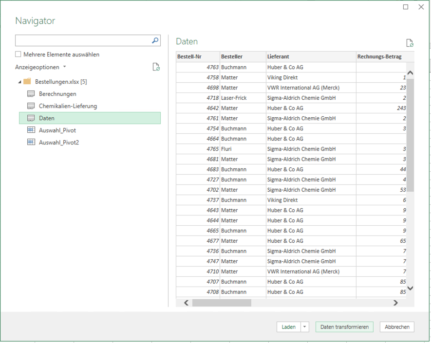
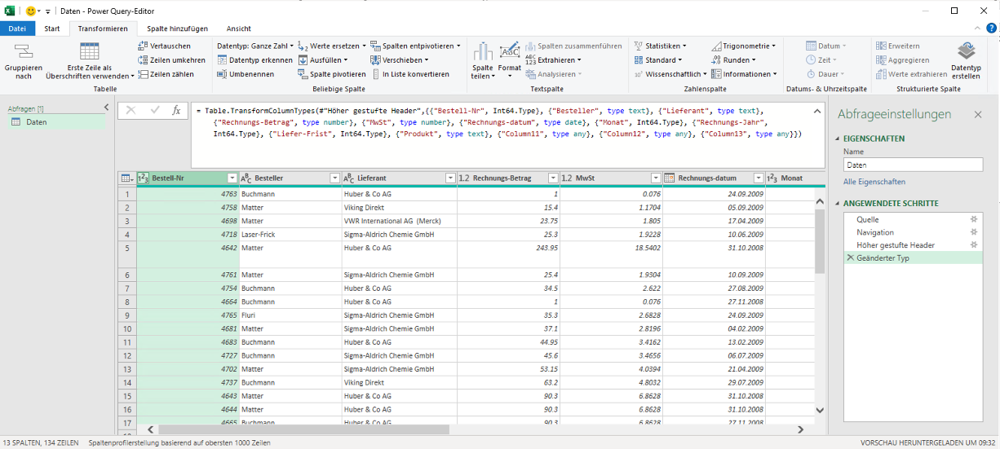
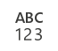
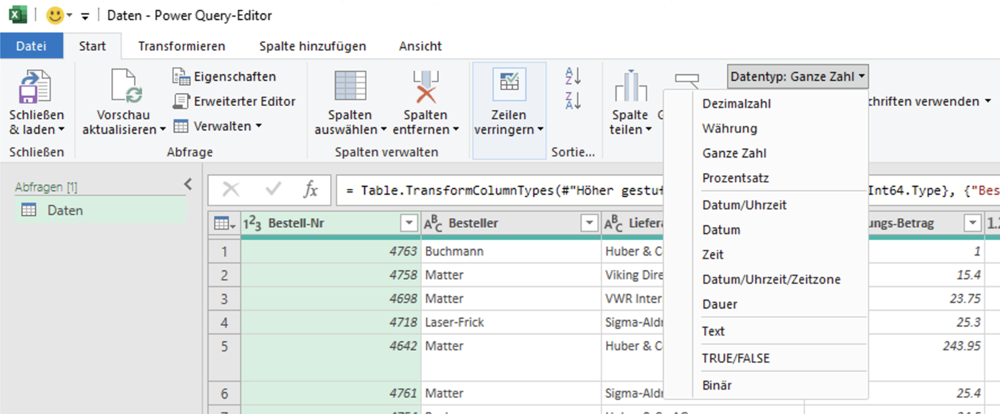
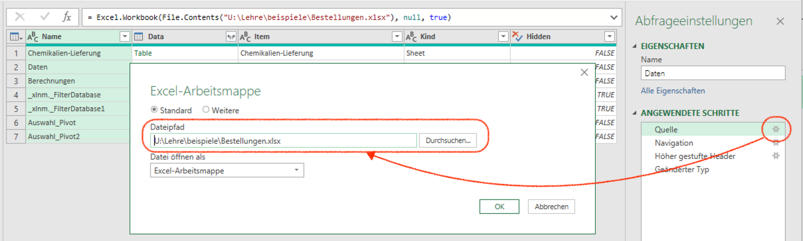

# Daten importieren {#sec-chapter-daten-importieren}

Viele Excel Arbeitsmappen kombinieren Berechnungen und Daten. Excel kann allerdings auch Daten aus anderen Quellen importieren. Quellen können andere Dateien, Datenbanken oder Web-APIs sein und in verschiedenen Formaten vorliegen. Dafür stellt Excel Parser für verschiedene Dateiformate bereit, damit die Daten importiert werden können. 

Daten werden korrekt mit dem Kommando **Daten abrufen (Power Query)** importiert. Das Kommando ist in der Gruppe **Daten** im Abschnitt **Daten abrufen und transformieren** zu finden. Das Kommando *Daten abrufen* startet die sog. **Power Query** Umgebung. In dieser Umgebung können Daten aus verschiedenen Quellen importiert und vor der Bereitstellung korrigiert werden. 

{#fig-menubalken-power-query-kommando-daten-abrufen}

::: {.callout-tip}
# Power Query

**Power Query** ist eine Umgebung für den Datenimport, die von verschiedenen Microsoft Produkten verwendet wird. Die Umgebung ist in Excel, Power BI, Power Apps und Power Automate verfügbar. Power Query stellt eine einheitliche Schnittstelle für den Datenimport bereit und basiert auf einer *Import-Beschreibungssprache*. Mit diese Sprache lassen sich Daten für die Arbeit vorbereiten, so dass viele Datenbereinigungsschritte in Excel Arbeitsmappen entfallen können.

{#fig-power-query-editor-fenster}

Zu den zentralen Funktionen von Power Query gehören:

- Quellenmanagement
- Überschriftenerkennung
- Schemaerkennung und -transformation
- Entfernen von Duplikaten und ungültigen Werten
- Vektorisierung von Daten
- Kombinieren von Daten aus verschiedenen Quellen
:::

::: {.callout-warning}
Viele tabellarische Dateiformate lassen sich direkt mit Excel öffnen. Das sollte nur mit Excel Arbeitsmappen erfolgen. Bei anderen Dateiformaten kann das direkte öffnen zu Datenverlusten oder Datenfehlern führen. Diese lassen sich in Excel nur umständlich korrigieren. 

Ausserdem lassen sich direkt geöffnete Dateien nicht mehr erweitern, was die Datenerhebung erschwert.
:::

Das Kernprinzip von *Power Query* ist das Verbinden einer Datenquelle mit einer Arbeitsmappen. Entsprechend heissen importierte Daten im Excel Jargon **Datenverbindungen**. Die Datenquelle wird dabei nicht in die Arbeitsmappe übernommen, sondern nur eine Verbindung zu der Datenquelle hergestellt. Dadurch kann eine Datenquelle in mehreren Arbeitsmappen verwendet werden und sich ändern, ohne dass die Arbeitsmappe angepasst werden muss. 

::: {.callout-note}
## Merke
Das Ergebnis eines Imports ist immer eine *Tabelle*.
:::

## Datenverbindungen herstellen

Eine Datenverbindung wird über das Kommando `Daten abrufen (Power Query)` ausgelöst. Das Kommando ist in der Gruppe **Daten** im Abschnitt **Daten abrufen und transformieren** zu finden. Das Kommando bereitet den Import durch Power Query vor, indem zuerst das Dateiformat und anschliessend die zugehörige Datenquellen ausgewählt wird. Nach diesen Schritten kann Excel die Daten `Laden` oder die `Daten transformieren` (s. @fig-power-query-laden-oder-transformieren).

::: {.callout-tip}
## Praxis
Die Daten sollten nur in Ausnahmefällen unkontrolliert geladen werden. Die Daten sollten vor dem Importieren in Power Query überprüft und transformiert werden. Dadurch wird sichergestellt, dass die Daten korrekt importiert werden.
:::

{#fig-power-query-laden-oder-transformieren}

Wird die Option `Daten transformieren` ausgewählt, öffnet sich der Power Query Editor. In diesem Editor können die Daten überprüft und transformiert werden. Das Transformieren der Daten umfasst vier Arten der Transformation:

1. Datentypanpassungen
2. Spaltenauswahl
3. Datentrennung
4. Daten kombinieren

Für jede Transformation wird ein Schritt in Power Query angelegt. Die Schritte werden in der Reihenfolge der Ausführung angezeigt. Die Reihenfolge der Schritte kann verändert werden, indem die Schritte mit der Maus verschoben werden. In der Mitte des Power Query Fensters wird eine Datenvorschau angezeigt, die die Auswirkungen der Transformationen zeigt.

Standardmässig werden drei bzw. bei Excel Arbeitsmappen vier Schritte in Power Query automatisch konfiguriert:

1. `Quelle`
    - Bei Excel Arbeitsmappen folgt dem Schritt `Quelle` der Schritt `Navigation` zur Auswahl des Arbeitsblattes.
2. `Höherstufen`
3. `Geänderter Typ` (Windows) bzw. `geänderter Spaltentyp` (MacOS)

Der Schritt `Geänderter Typ` enthält die Schemadefinition. Power Query versucht das Schema automatisch zu erkennen. Das funktioniert besonders bei Zahlenwerten nicht immer zuverlässig. Deshalb muss das Schema immer kontrolliert und gegebenenfalls angepasst werden.

{#fig-power-query-editor-scheme}

Nachdem das Schema kontrolliert wurde, können die Daten nach Excel importiert werden. Dazu wird das Kommando `Schließen & laden` in Power Query Menukategorie `Start` ausgeführt. 

Nach einem Datenimport liegen die Daten in der Arbeitsmappe als *Tabelle* vor. Diese Daten sind eine Kopie der Daten in der Datenquelle. Dadurch kann die Arbeitsmappe unabhängig von der Datenquelle verwendet und geteilt werden.

::: {.callout-warning}
## Achtung

Excel betrachtet jeden Datenimport als Sicherheitsproblem. Daher werden Datenverbindungen beim Öffnen einer Arbeitsmappe standardmässig deaktiviert. Beim Öffnen einer Arbeitsmappe mit einer Datenverbindung wird eine Warnung angezeigt. Um mit den importierten Daten arbeiten zu können, muss die Datenverbindung *aktiviert* werden.

Wird die Datenverbindung nicht aktiviert, werden Funktionen die auf die Daten zugreifen nicht ausgeführt, sondern nur die Ergebnisse der letzten Ausführung angezeigt.
:::

## Datenschema anpassen

Die einfachste Möglichkeit zur Anpassung des Datenschemas ist die Verwendung der Menukategorie `Transformation`. Dieses Menu zeigt alle verfügbaren Transformationen an. Die Transformationen sind in sechs Kategorien gegliedert: 

{#fig-power-query-ribbon-transformation}

1. `Tabelle`
2. `Beliebige Spalte` 
3. `Textspalte`
4. `Zahlenspalte`
5. `Datums- & Uhrzeitspalte`
6. `Strukturierte Spalte`

Für das Datenschema sind die folgenden Transformationen wichtig:

- `Datentyp`
- `Umbenennen`
- `Verschieben`
- `Spalte teilen`

::: {.callout-note}
Die meisten Transformationen gehören konzeptionell zu späteren Kapiteln. 

- `Gruppieren nach` und `Werte ersetzen` werden im @sec-chapter-kodieren-gruppieren behandelt.
- `Vertauschen` wird im @sec-chapter-matrix-operationen behandelt.

- `Zellen zählen`, `Ausfüllen` und alle Transformationen in den Kategorien `Zahlenspalten`, `Datums- & Uhrzeitspalten` und `Strukturierte Spalten` werden im @sec-chapter-vektor-operationen behandelt.
- `Spalte pivotisieren` und `Spalte entpivotisieren` werden im @sec-chapter-daten-formen behandelt.
- `Format`, `Analysieren` und `Extrahieren` (Kategorie `Textspalte`) werden im @sec-chapter-zeichenketten behandelt.

In diesen Kapiteln werden die Transformationen von Power Query separat hervorgehoben.
:::

### Datentyp anpassen

Die wichtigste Transformation ist die Anpassung des Datentyps. Der Datentyp bestimmt, wie die Daten interpretiert werden. Die Interpretation der Daten bestimmt, welche Operationen auf die Daten angewendet werden können.

::: {.callout-important}
Die Datentypen müssen im Schritt `Geänderter Typ` (Windows) bzw. `geänderter Spaltentyp` (MacOS) angepasst werden.
:::

Power Query zeigt neben den Spaltenüberschriften mit einem Symbol den Datentyp der Spalte an. 
@tbl-power-query-datentypen zeigt die Symbole für die verschiedenen Datentypen. Zusätzlich wird der Datentyp im Menubalken neben dem Kommando `Datentyp` angezeigt. Die Datentypen sind in vier Kategorien unterteilt:

- Zahlen
- Datum und Uhrzeit
- Zeichenketten
- Wahrheitswerte

Im Gegensatz zu Excel behandelt Power Query Datum und Uhrzeit als eigenen Datentyp. Power Query muss diese Unterscheidung machen, weil in den Datenquellen diese Werte als Zeichenketten kodiert vorliegen. Dabei handelt es sich um *strukturierte Daten*. Power Query hat für diese Daten spezielle *Parser*, die die Zeichenketten aus der Datenquelle in Zahlenwerte für Excel umwandeln.

| Datentyp | Symbol | Kategorie | Bemerkungen |
| :---| :---: | :---: | :---------- |
| Text | {width=32} | Zeichenketten | |
| TRUE/FALSE | {width=32} | Wahrheitswerte | |
| Dezimalzahl | {width=32} | Zahlen | |
| Ganze Zahl | {width=32} | Zahlen | |
| Prozentzahl | {width=32} | Zahlen | Dezimalzahl mal `100` |
| Währung | {width=32} | Zahlen | Dezimalzahl mit Währungsformatierung |
| Binärzahl | {width=32} | Zahlen | Ganzzahl |
| Zahl mit Gebietsschema | {width=32} | Zahlen | ***Nur MacOS***; Das Gebietsschema legt den Tausender- und Dezimaltrenner fest |
| Datum/Uhrzeit | {width=32} | Datum und Uhrzeit | Zeitstempel als formatierte Dezimalzahl |
| Datum | {width=32} | Datum und Uhrzeit | Ganzzahl mit Datumsformatierung |
| Uhrzeit | {width=32} | Datum und Uhrzeit | Dezimalzahl zwischen 0 und 1 mit Zeitformatierung |
| Dauer | {width=32} | Datum und Uhrzeit | Dezimalzahl als Zeitdauer |
| Datum/Uhrzeit/Zeitzone | {width=32} | Datum und Uhrzeit | Internationalisierter Zeitstempel als formatierte Dezimalzahl, die Zeitzone **muss** in den Werten kodiert sein, sonst wird +1 angeommen. |

: Power Query Datentypen mit Symbolen {#tbl-power-query-datentypen}

Der Datentyp einer Spalte lässt sich mit dem Kommando `Datentyp` anpassen. Wird auf das Kommando im Menubalken geklickt, öffnet sich eine Auswahlliste, aus der der richtige Datentyp ausgewählt werden kann (@fig-pq-spaltentyp-aendern). Wird der Datentyp geändert, dann erfolgt eine Abfrage (s. @fig-pq-datentyp-schritt-dialog), ob der Datentyp im aktuellen Arbeitsschritt erstzt werden soll (`Aktuelle ersetzen`) oder ob ein neuer Arbeitsschritt eingefügt werden soll (`Neuen Schritt hinzufügen`). Hier kann normalerweise `Aktuelle ersetzen` ausgewählt werden.

{#fig-pq-spaltentyp-aendern}

{#fig-pq-datentyp-schritt-dialog}

### Spalten umbenennen

Falls einzelne Spaltenüberschriften einer Datenquelle unhantlich sind, lassen sich diese Spalten umbenennen. Dazu wird das Kommando `Umbenennen` verwendet. Das Kommando ist im Menuband `Transformieren` im Abschnitt `Beliebige Spalte` zu finden. Das Kommando öffnet einen Dialog, in dem der neue Name der Spalte eingegeben werden kann. Die Überschrift wird in einem eigenen Arbeitsschritt geändert.

Spalten lassen sich auch durch einen Doppelklick auf den Spaltennamen umbenennen.

Die Spaltenüberschriften müssen für die Datenstruktur *eindeutig* sein. Wird eine Spaltenüberschrift doppelt verwendet, dann gibt Power Query eine Fehlermeldung aus.

::: {.callout-tip}
## Praxis
Das Kommando `Umbenennen` sollte nur verwendet werden, wenn nur einzelne Spalten umbenannt werden müssen. Falls mehrere Spalten umbenannt werden müssen, sollte dieser Schritt als Transformation in Excel durchgeführt werden.
:::

### Spalten verschieben

In Excel können nur zusammenhängende Bereiche einer Tabelle mit einer Adressierung gemeinsam angesprochen werden. Diese Reihenfolge ist immer dann hilfreich, wenn Matrix-Operationen mit diesen Daten ausgeführt werden sollen. Falls die Spalten einer Datenquelle in einer ungünstigen Reihenfolge vorliegen, lassen diese sich mit einem Kommando unter `Verschieben` richtig positionieren.

### Spalte teilen

Manche Daten fassen mehrere Werte in der einer Spalte zusammen. Falls die Werte als strukturierte Daten vorliegen, kann diese Spalte mit dem Kommando `Spalte teilen` in mehrere Spalten aufgeteilt werden. Dabei werden drei Varianten unterschieden. 

1. Die Separator-Trennung verwendet Trennzeichen zum Abgrenzen der Werte. 
2. Die Positions-Trennung trennt Festkodierungen mit festen Positionen in einzelne Spalten.
3. Die Längen-Trennung trennt Festkodierungen, deren Werte immer die gleiche Anzahl von Symbolen haben.

Die Separator-Trennung kann ein festes Trennzeichen oder ein Trennungsmuster verwenden. Die möglichen Trennungsmuster sind:

- Beim Wechsel zwischen kleinen und grossen Buchstaben.
- Beim Wechsel zwischen grossen und kleinen Buchstaben. 
- Beim Wechsel zwischen Ziffern und Nicht-Ziffern.
- Beim Wechsel zwischen Nicht-Ziffern und Ziffern.

Beim trennen von Spalten dürfen nicht semistrukturierte Daten getrennt werden, weil diese nicht für alle Werte die gleiche Struktur haben.

## Spalten auswählen oder entfernen

Zwei besondere Transformationen sind `Spalten auswählen` und `Spalten entfernen`. Diese Transformationen werden im Menuband `Start` angeboten. Mit diesen Transformationen lassen sich unbenötigte Spalten aus den Daten entfernen. Dadurch werden die Daten in Excel übersichtlicher. 

Diese Funktion kommt bei Excel-Arbeitsmappen häufig zum Einsatz, wenn nach Ende der Daten zusätzliche leere Spalten folgen. Diese Spalten können mit `Spalten entfernen` entfernt werden.

{#fig-power-query-editor-spalten-auswaehlen-entfernen}

Beide Kommandos verändern die Datenstruktur, indem Spalten entfernt werden. Das Kommando `Spalten auswählen` lässt die ausgewählten Spalten in der Datenstruktur und entfernt alle anderen. Das Kommando `Spalten entfernen` entfernt nur die ausgewählten Spalten.

::: {.callout-warning}
## Achtung
Eine spezielle Variante von `Spalten auswählen` ist das Kommando `In Liste konvertieren` im Menuband `Transformieren`. Dieses Kommando entfernt alle bis auf die ausgewählte Spalte. Dieses Kommando ändert jedoch die Spaltenüberschrift und sollte deshalb nicht verwendet werden.
:::

## Daten aktualisieren

Die Daten können sich aber ändern, z.B. weil ein Formular ausgefüllt wurde oder eine Datenbank aktualisiert wurde. Dadurch ändern sich die Daten in der Datenquelle. In solchen Fällen ist die Kopie in der Arbeitsmappe nicht mehr aktuell. Um die Daten zu aktualisieren, muss die Datenverbindung aktualisiert werden.

Dazu wird das Kommando **Alle aktualisieren** verwendet. Das Kommando ist im Menu **Daten** im Abschnitt **Verbindungen** zu finden. Das Kommando aktualisiert alle Datenverbindungen in der Arbeitsmappe entsprechend der Importspezifikation.

{#fig-menubalken-daten-kommando-alle-aktualisieren}

Es werden nur die importierten Daten aktualisiert. Wurde die Tabelle durch Formeln erweitert, werden diese Formeln *nicht* gelöscht, sondern auf die neuen Daten erweitert. 

::: {.callout-important}
Die importierte Struktur darf **nicht verändert** werden. Das bedeutet, dass innerhalb der Struktur keine Spalten hinzugefügt oder gelöscht werden dürfen. Neue Spalten für Formeln müssen rechts von der importierten Datenstruktur der Tabelle hinzugefügt werden.
:::

## Datenverbindung anpassen

Gelegentlich ändert sich der Ort einer Datenquelle. Sehr häufig tritt diese Situation ein, wenn eine Datei in einen anderen Ordner verschoben wird. In solchen Fällen muss die Datenverbindung angepasst werden. Dazu muss in Power Query die Datenquelle angepasst werden.

1. Powerquery öffnen
2. Einstellungen im Schritt "Quelle" auswählen (s. @fig-power-query-editor-datenquelle-anpassen)
2. Pfad zur Datenquelle anpassen

Nachdem die richtige Datei ausgewählt wurde, sollte immer das Schema kontrolliert werden, ob die Änderung keine Auswirkungen auf das Schema hat. Wird dieser Schritt übersprungen, kann es zu Fehlern beim Import kommen und im schlimmsten Fall werden die Formeln in der Arbeitsmappe durch eine Fehlerfortpflanzung zerstört.

Abschliessend kann wieder das Kommando **Schliessen & Landen** ausgeführt werden.

{#fig-power-query-editor-datenquelle-anpassen}

Alle Datenverbindungen werden auch im Dialog **Abfragen & Verbindungen** (s. @fig-menubalken-daten-abfragen-verbindungen) angezeigt. Der Dialog ist in der Gruppe **Verbindungen** im Abschnitt **Daten** zu finden. Der Dialog zeigt alle Datenverbindungen an, die in der Arbeitsmappe verwendet werden. 

{#fig-menubalken-daten-abfragen-verbindungen}

::: {.callout-warning}
## MacOS vs. Windows
Unter Windows lassen sich die Datenquellen im Dialog **Abfragen & Verbindungen** anpassen. Die Windows Version von Excel von dort immer den Power Query Editor. Die Version für MacOS macht das nicht. Um Änderungen an einer Abfrage vorzunehmen, muss die Abfrage in Power Query über das Kommando `Daten abrufen` geöffnet werden (s. @fig-power-query-unter-macos-starten).

{#fig-power-query-unter-macos-starten}
::: 
