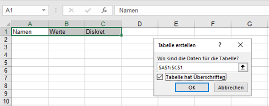
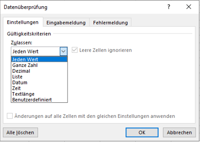
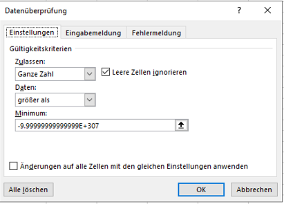

# Daten sammeln {#sec-chapter-daten-sammeln}

## Daten mit Formularen sammeln {#sec-datacollection-forms}

Die direkte Eingabe von Daten ist nur für kleine Datensätze mit wenigen Merkmalen geeignet. Bei grösseren Datensätzen ist die direkte Eingabe oft zu aufwändig und fehleranfällig. Für die strukturierte Dateneingabe von grösseren Datensätzen werden Formulare verwendet. 

Bei der Dateneingabe über Formulare werden die Daten mithilfe von *Fragen* mit vorgegebenen Antworttypen gesammelt. Der Antworttyp bestimmt, welche Werte für die Frage zulässig sind.

::: {.callout-note}
In vielen Formularsystemen wird der *Antworttyp* als ***Fragetyp*** bezeichnet, obwohl die Frage immer in Text-Bildform präsentiert wird und der *Typ* durch die unterschiedlichen Antwortmöglichkeiten bestimmt wird.
:::

Durch das Festlegen des Antworttyps wird gleichzeigt der Wertebereich des gemessenen Merkmals definiert. Dadurch ergibt sich beim Erstellen eines Formulars das Datenschema automatisch.

Excel hat kein eingenes Formularsystem. Stattdessen kann [Microsoft Forms](https://www.microsoft365.com/launch/forms) verwendet werden. Microsoft Forms ist ein Online-Formulardienst, der in Microsoft365 integriert ist. Forms sammelt die Eingaben mit einem Formular und speichert die Daten in einer Excel Arbeitsmappe. Diese Formulare können über einen Web-Link geteilt werden und im Web-Browser ausgefüllt werden. Dadurch kann das Datensammeln auf verschiedene Personen verteilt werden.

::: {.callout-note}
Ein Formular kann in Microsoft Forms ein **Quiz** oder ein **Formular** sein. Ein Quiz ist ein Formular, bei dem die Antworten mit einer Punktzahl bewertet werden und ein Feedback erhalten können. Ein Formular fokussiert sich auf die reine Dateneingabe.
:::

Microsoft Forms unterstützt die folgenden Antworttypen:

- Offene Antworttypen
    - Offene Texteingabe
    - Dateumseingabe
    - Datei hochladen
- Geschlossene Antworttypen
    - Einfachauswahl
    - Mehrfachauswahl
    - Rangfolge
    - Likert-Skala
    - Bewertung
    - Net Promoter Score

Jede dieser Varianten hat die folgenden gemeinsamen Optionen:

- Eine einleitende Frage oder Anweisung.
- Ein optionaler Untertitel oder eine Beschreibung. (*Untertitel*)
- Die Möglichkeit eine mathematische Formel zur Validierung des Wertebereichs anzugeben (*Mathematik*).
- Das erzwingen einer Antwort (*Erforderlich*).
- Eine Verzweigung zu einer anderen Frage, wenn eine bestimmte Antwort gegeben wird (*Verzweigung*).

Die Unterschiede ergeben sich in den Antwortmöglichkeiten.

### Offene Texteingabe (*Text*)

Die offene Texteingabe erlaubt einzeilige und mehrzeilige (*lange*) *offene Antworten* möglich sind. Damit können un- oder semistrukturierte Daten erfasst werden. Diese Antwortmöglichkeit lässt sich auf Zahlenwerte und Zahlenintervalle eingeschränken.

### Datumseingabe (*Datum*)

Diese Eingabe ist eine Variante der *offenen Texteingabe* zur Eingabe eines Datums. Diese Eingabe wird durch die Option ergänzt, das Datum über eine Kalenderdarstellung  auszuwählen.

Das eingegebene Datum wird als Zahl gespeichert und als Datum dargestellt. 

### Datei hochlanden 

Die zweite Variante für *offene Antworten* ist das Hochladen von Dateien. Mit diesem Antworttyp lassen sich Bilder, Videos oder Tonaufnahmen leicht erfassen.

### Einfachauswahl (*Auswahl*)

Die Einfachauswahl ist ein Single-Choice-Antworttyp. Es sind nur die vorgegebenen Antwortmöglichkeiten möglich, von denen nur eine ausgewählt werden kann. Die Antwortmöglichkeiten können als Text oder als Bild angegeben werden. Die Antwortmöglichkeiten werden immer in einer Liste angezeigt. Dabei kann zwischen einem Auswahlmenu als *Dropdown*-Liste und frei anwählbaren Antwortmöglichkeiten (*Optionen*) gewählt werden. 

Die Reihenfolge der Antwortmöglichkeiten kann durch die Option `Optionen in zufälliger Reihenfolge` für jedes Formular zufällig angeordnet werden. Diese Option ist sinnvoll, wenn die Reihenfolge der Antwortmöglichkeiten die Antwort beeinflussen könnte. Soll ein Formular mehrfach durch die gleichen Personen ausgefüllt werden, dann sollte diese Option nicht aktiviert werden.

Das Ergebnis der Einfachauswahl ist eine Zeichenkette der ausgewählten Option.

### Mehrfachauswahl (*Auswahl*)

Die Mehrfachauswahl erlaubt die Auswahl mehrerer Antwortmöglichkeiten, indem die Option `Mehrere Antworten` aktiviert wird. Dieser Antworttyp ist ansonsten identisch mit der Einfachauswahl.

Das Ergebnis der Mehrfachauswahl ist eine Zeichenkette mit den ausgewählten Optionen. Wurden mehrere Antworten ausgewählt, dann werden die Optionen durch ein Semikolon getrennt.

### Rangfolge

Die Rangfolge erlaubt es, dass die angebotenen Antwortmöglichkeiten in eine Reihenfolge gebracht werden können. Bei diesem Antworttyp müssen die Werte sortiert werden und die Sortierung wird als Antwort gespeichert. 

Bei der Darstellung werden die Antwortmöglichkeiten in einer Liste angezeigt und für jedes Formular neu sortiert.

Das Ergebnis der Rangfolge ist eine Zeichenkette mit der Reihung der Optionen. Die Optionen werden durch ein Semikolon getrennt. Im Ergebnis lässt sich die Rangfolge nicht von einer Mehrfachauswahl unterscheiden.

### Likert-Skala (*Likert*)

Der Antworttyp *Likert* setzt eine Fragebatterie mit Likert-Skalen um. Darüber lässt sich ein *semantisches Differential* erheben. 

Die Anworten dieser Fragebatterie werden wie mehrere Einfachauswahlen als Zeichenketten gespeichert. Deshalb muss für diesen Antworttyp immer eine Kodierungstabelle für die richtige Reihenfolge der Werte dokumentiert werden.

### Bewertung

Die Bewertung ist eine Variante des Antworttyps *Likert-Skala*. Mit der Bewertung wird über eine festgelegte Skala der gewünschte Wert abgefragt. Optional können für die beiden Extremwerte Beschriftungen angegeben werden.

Das Ergebnis wird als Zahl gespeichert. Die Zahl entspricht dem Wert der ausgewählten Option beginnend bei 1. 

### Net Promoter Score

Der Typ Net Promoter Score ist eine spezielle elfstufige Liker-Skala, die zwischen zwei frei wählbaren Extremwerten festgelegt ist. Die offiziell als *Net Promoter Score* [@reichheld_one_2003] bezeichnete Eingabeform ist eine verzerrte Likert-Skala mit dem Mittelpunkt bei `7.5`. 

Der Net Promoter Score wird immer als Ganzzahl im Intervall $0 \le s \le 10$ zurückgegeben.

::: {.callout-warning}
Der Net Promoter Score hat im Management-Umfeld eine grosse Verbreitung gefunden. Die Verwendung dieser Skala ist aber umstritten [@keiningham_longitudinal_2007]. Speziell die proklamierte Aussagekraft lässt sich nicht belegen [@fisher_good_2019; @grisaffe_questions_2007]. Von der verbreiteten isolierten Verwendung des Net Promoter Score nach der Methode von @reichheld_one_2003 wird deshalb abgeraten.

Wird diese Eingabe als Likert-Skala verwendet, dann besteht ausser bei der Darstellung kein Unterschied zur *Einfachauswahl* oder der *Bewertung*.
:::

### Darstellung der Ergebnisse in Excel

Die Ergebnisse der Formulare werden in einer Excel-Arbeitsmappe als Tabelle gespeichert. Die Antworten sind in der Spalte `ID` sequenziell durchnummeriert. Zusätzlich enthält die Tabelle zwei sog. *Zeitstempel* mit Datum und Uhrzeit des Beginns (`Startzeit`) und des Endes (`Fertigstellungszeit`) der Datenerfassung eines Formulars. Optional können die Namen und E-Mail-Adressen der ausfüllenden Person miterfasst werden. 

Nach diesen Basisinformationen folgen die einzelnen Antworten für die Formularelemente. Die Werte in der gleichen Zeile entsprechen dabei den Werten aus dem gleichen Formular. Die Spaltenüberschriften sind Standardmässig der Fragetext. 

## Daten direkt eingeben

Bei der direkten Eingabe von Daten muss zuerst die Ergebnistabelle manuell erstellt werden, um damit die Daten zu sammeln.

Damit die Daten einheitlich erfasst werden, benötigt die Tabelle ein Schema. In Excel wird diese Schema über die Tabellenüberschriften definiert und kann bei einer späteren Verarbeitung weiter angepasst werden (s. @sec-chapter-daten-importieren).

Ein einfaches Datenschema umfasst nur die Spaltenüberschriften, die erfasst werden sollen. Dazu müssen die Tabellenüberschriften definiert werden. Die Tabellenüberschriften werden in der ersten Zeile der Tabelle eingetragen. Überschriften für weitere Merkmale können zu einem späteren Zeitpunkt noch ergänzt werden. Anschliessend werden die Überschriften markiert und es wird für diesen Bereich eine **Tabelle** eingefügt. Hierbei muss die Option `Tabelle hat Überschriften` aktiviert werden (s. @fig-tabelle-erstellen).

{#fig-tabelle-erstellen}

Daten werden der Tabelle hinzugefügt, indem in der Zeile unterhalb der Tabelle neue Werte eingetragen werden. Die Tabellenstruktur mit dem Schema wird automatisch erweitert.

### Schemadefinition durch Datenüberprüfung

Die einfache Schemadefinition stellt nicht sicher, dass die Werte einheitlich abgelegt werden. Das kann später die Datenerfassung und die Datenverarbeitung behindern. Wurde die Datentabelle mit einem Überprüfungsschema erstellt, dann können die Werte in die Tabelle eingetragen und bei der Eingabe validiert werden.

Die Schemadefinition durch Datenüberprüfung erlaubt die Wertebereiche der gemessenen Merkmale vorab festzulegen. Dadurch lassen sich potentielle Fehler bereits bei der Dateneingabe vermeiden. Hierzu ist es notwendig, die **Wertebereiche** und die zugehörige **Datenklasse** einer Spalte zu bestimmen. 

::: {.callout-tip}
# Praxis

Das Erstellen eines Schemas zur Dateneingabe ist in Excel zwar aufwändig, dennoch sollte dieser Schritt nicht übersprungen werden, weil die Datenüberprüfung die Datenqualität verbessert und die Datenverarbeitung erheblich vereinfacht.
:::

In Excel müssen Vektoren durch die Option *Datenüberprüfung* definiert werden. Die Option *Datenüberprüfung* findet sich im Ribbon unter *Daten* (s. @fig-datenueberpruefung-ribbon) im Abschnitt *Datentools* (s. @fig-datenueberpruefung-datentools-details). 

{#fig-datenueberpruefung-ribbon}

{#fig-datenueberpruefung-datentools-details}

Die Schemadefinition erfolgt in drei zusätzlichen Schritten:
 
2. Es wird eine *Platzhalterzeile* eingefügt, indem die Zelle unterhalb der ersten Überschrift ausgewählt wird. Die Platzhalterzeile wird benötigt, um die Datenüberprüfung zu definieren.
3. Für jeden Vektor wird mit der Option *Datenüberprüfung* eine Datenüberprüfung für den gewünschten Wertebereich definiert.
4. Die Platzhalterzeile wird gelöscht.

### Funktionsweise der Datenüberprüfung

Die Datenüberprüfung ist eine Funktion, die auf einen Bereich angewendet wird, wobei der Bereich eine einzelne Zelle, einer Zeile oder eine Spalte sein kann. Für das Schema einer Tabelle wird die Datenüberprüfung für eine Spalte eingerichtet. 

Die Datenüberprüfung wird Zellenweise konfiguriert, wobei die erste Zelle eines Bereichs die Referenzzelle ist. Die Datenüberprüfung wird auf die Referenzzelle angewendet und diese Konfiguration wird auf alle Zellen des Bereichs übertragen und automatisch so angepasst, dass die aktuelle Zelle überprüft wird. Dabei sind ein paar Besonderheiten zu beachten.

* Die Datenüberprüfung muss mit konstanten Adressen konfiguriert werden. Es muss also die doppelte Dollar-Adressierung (z.B. `$A$2`) verwendet werden. 
* Wird nicht die Referenzzelle als Adresse verwendet, dann erfolgt die Datenüberprüfung mithilfe der Werte der angegebenen Adresse. In den folgenden Zellen wird dann der relative Versatz zur Referenzzelle verwendet. 
* Konstante Werte müssen in der Datenüberprüfung explizit angegeben und nicht über Bezüge verwiesen werden.

Excel bringt einige vordefinierte Überprüfungen mit, die über die Dropdown-Liste ausgewählt werden können. Die meisten Überprüfungen sind für Zahlenintervalle definiert. Die Standardeinstellung `Jeden Wert` ist gleichbedeutend mit keiner Überprüfung, weil alle Werte als Eingabe akzeptiert werden. Generelle Überprüfungen von Datentypen sind nicht vorgegeben und müssen über die Option `Benutzerdefiniert` definiert werden.

{#fig-datenueberpruefung-dialog}

::: {.callout-note}
Wird die Datenüberprüfung auf eine Zelle in einer Tabelle angewendet und in der jeweiligen Spalte existieren noch keine anderen Werte, dann wird die Datenüberprüfung für die gesamte Spalte übernommen. Stehen in der Tabelle bereits Werte, dann müssen zuerst alle Werte in der Spalte ausgewählt werden, bevor die Datenüberprüfung eingerichtet wird. Neue Werte übernehmen die Datenüberprüfung der vorangehenden Zeile.
:::

### Datenüberprüfung für Zahlen, Zeichenketten oder Wahrheitswerte

Eine generelle Überprüfung für die fundamentalen Datentypen ist in Excel nicht vorgesehen. Solche Überprüfungen müssen über die Option `Benutzerdefiniert` festgelegt werden. 

Im Eingabefeld Formel kann eine beliebig komplexe Formel stehen. Die Formel muss einen Wahrheitswert zurückgeben. Wird der Wahrheitswert `WAHR` zurückgegeben, dann wird der Wert akzeptiert. Wird der Wahrheitswert `FALSCH` zurückgegeben, dann wird der Wert nicht akzeptiert.

Um die fundamentalen Datentypen zu überprüfen, können die Informationsfunktionen `ISTZAHL()`, `ISTTEXT()` und `ISTLOG()` verwendet werden (s. @tbl-datenueberpruefung-fundamentale-datentypen). Diese Funktionen geben `WAHR` zurück, wenn der Wert dem angegebenen Datentyp entspricht. Ansonsten geben sie `FALSCH` zurück.

| Datentyp      | Überprüfungsausdruck |
|---------------|----------------------|
| Zahlen        | `=ISTZAHL($A$2)`     |
| Zeichenketten | `=ISTTEXT($A$2)`     |
| Wahrheitswerte| `=ISTLOG($A$2)`      |

: Überprüfungsausdrücke für die fundamentalen Datentypen {#tbl-datenueberpruefung-fundamentale-datentypen}

### Datenüberprüfung für ganze Zahlen

Die Überprüfung ganzer Zahlen ist in Excel über die Option `Ganze Zahl` möglich. Diese Option überprüft, ob der Wert eine ganze Zahl ist. Diese Option kann aber nicht direkt für alle ganze Zahlen eingesetzt werden. Um alle zulässigen ganzen Zahlen zu erfassen muss unter der Option `Daten` der Punkt `größer als` ausgewählt werden. Anschliessend muss als `Minimum` der Wert `-9.99999999999999E+307` eingetragen werden (s. @fig-datenueberpruefung-ganze-zahlen). Dieser Wert ist der kleinste Wert, der in Excel als (ganze) Zahl erfasst werden kann [@microsoft_excel_2023]. 

{#fig-datenueberpruefung-ganze-zahlen}

### Datenüberprüfung für ordinalskalierte Wertebereiche

Für ordinalskalierte Wertebereiche sollten die Werte am Besten als Ganzzahlen erfasst werden. Damit zu einem späteren Zeitpunkt diese Zahlen den eigentlichen Werten zugeordnet werden können, wird eine Zuordnungstabelle benötigt. Diese Zuordnungstabelle wird in einer separaten Tabelle erstellt. Diese Tabelle besteht aus zwei Spalten: Dem Zahlenwert und dem zugeordneten Wert. Die Ordnung der Werte ergibt sich aus der Ordnung der zugeordneten Zahlen.

::: {.callout-important}
Häufig muss bei ordinalskalierten Wertebereichen die Option einer nicht zutreffenden Antwort berücksichtigt werden. In diesem Fall muss eine zusätzlicher Zahlenwert ausserhalb der regulären Ordnung definiert werden. Dieser Wert wird dann der nicht zutreffenden Antwort (z.B. `NA` oder `nicht zutreffend`) zugeordnet.
:::

Damit der Wertebereich korrekt eingeschränkt wird, muss die Option `Liste` verwendet werden. Die `Quelle` entspricht der Spalte mit den zugeordneten Zahlenwerten in der Zuordnungstabelle. Die Option `Zellendropdown` kann deaktiviert werden.

::: {.callout-warning}
## Achtung

Die Datenüberprüfung kann nicht mit Tabellenadressen umgehen. Deshalb müssen die gültigen Werte als absolute Arbeitsblattadressen angegeben werden (s. @fig-datenueberpruefung-mit-zuordnungstabelle).
:::

{#fig-datenueberpruefung-mit-zuordnungstabelle}

### Datenüberprüfung für nominalskalierte Wertebereiche

Die Überprüfung nominalskalierter Wertebereiche wird in Excel durch die Option `Liste` realisiert. Die Option `Liste` erlaubt die Auswahl von Werten aus einer Liste in der gleichen Arbeitsmappe. Diese Liste ist einfach ein Bereich mit Werten, eine Spalte in einer anderen Tabelle oder eine benannte Liste (s. @sec-chapter-variablen-fkts-ops). Die Liste muss in einer Spalte definiert werden, weil die Datenüberprüfung nur auf Spalten angewendet werden kann. Deshalb ist es nicht möglich, eine zeilenorientierte Liste für die Datenüberprüfung anzuwenden.

Für nominalskalierte Wertebereiche werden alle zulässigen Werte in einer Spalte gestgelegt. Anschliessend wird im Dialog Datenüberprüfung unter `Quelle` der Bereich mit den zulässigen Werten angegeben.

::: {.callout-tip}
Im Gegensatz zu ordinalskalierten Wertebereichen, sollten nominalskalierte Wertebereiche nicht als Zahlen kodiert werden, sondern als Zeichenketten erfasst werden.
:::

Bei der Dateneingabe wird anschliessend ein Auswahlliste mit den zulässigen Werten, so dass die Werte nicht mehr direkt eingetippt werden müssen. Diese Auswahlliste kann unterbunden werden, wenn die Option `Zellendropdown` deaktiviert wird.
