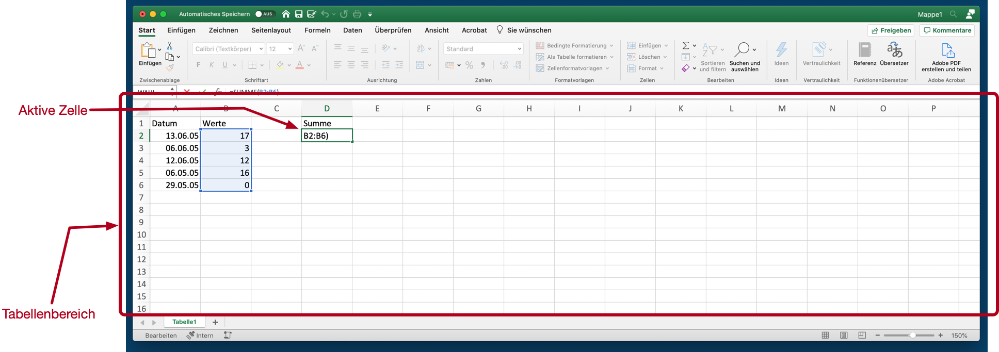
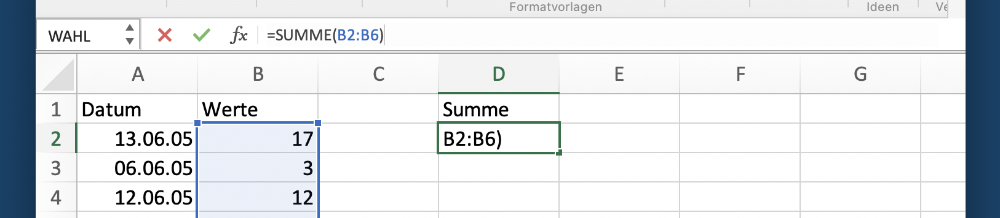

# Bedienoberfläche

## Arbeitsblätter

Der Tabellenbereich ist das zentrale Element von Excels Arbeitsoberfläche. Dabei handelt es sich um den Datenbereich, der sich deutlich durch das beschriftete Gitterraster im Zentrum des Excel-Fensters abhebt und den Grossteil der Arbeitsoberfläche einnimmt. Über dieses Raster wird primär mit Daten und Funktionen interagiert. Der Tabellenbereich zeigt einen Ausschnitt des aktuellen Arbeitsblatts.

{#fig-arbeitsfenster}

::: {#def-arbeitsblatt}
Ein Excel Arbeitsblatt ist ein Gitterraster, das aus Zellen besteht. Jede Zelle kann einen Wert enthalten.
::: 

::: {#def-zelle}
Eine **Zelle** ist ein Feld im Raster eines Arbeitsblatt.
:::

Excel zeigt durch eine Hervorhebung an, welche Zelle aktuell markiert ist. Diese **Markierung** kann mit der Maus oder mit den Pfeiltasten bewegt werden. Wenn nur eine Zelle markiert ist, dann entspricht die Markierung der **aktiven Zelle**. Eine Markierung kann auch mehrere Zellen umfassen. In diesem Fall wird die *aktive Zelle* durch eine helle Hervorhebung gekennzeichnet, während der Rest der Markierung ausgegraut ist. Alle Eingaben mit der Tastatur bezeihen sich immer auf die aktive Zelle.

Oben und Links vom Tabellenbereich findet sich die Beschriftung für die Spalten und Zeilen. Spalten werden mit Buchstaben benannt, Zeilen werden mit Zahlen benannt. Daraus ergibt sich ein Koordinatensystem, mit dem jede Zelle eindeutig adressiert wird. 

::: {#def-koordinaten}
Die Koordinaten einer Zelle bezeichnen wir als **Adresse**.
:::
 
Im [Abschnitt @sec-adressierung-ds] werden die verschiendenen Arten der Adressierung von Zellen und Zellbereichen detailliert beschrieben.

## Arbeitsblattreiter

Direkt unter dem Tabellenbereich zeigt Excel *Register* mit den Namen der Arbeitsblätter. Diese Register zeigen alle Arbeitsblätter einer Excel-Arbeitsmappe. Wenn eine neue, leere Arbeitsmappe erstellt wird, dann enthält diese nur ein Arbeitsblatt mit dem Namen ``Tabelle 1``.
Mit dem ``Plus``-Symbol neben dem **Arbeitsblattregistern** können zusätzliche Arbeitsblätter in der Arbeitsmappe erzeugt werden.

## Menubalken

{#fig-menubalken}

Am oberen Fensterrand von Excel befindet sich der **Menubalken**, der im Excel Jargon "Ribbon" heisst. Der Menubalken ist in verschiedene Kategorien unterteilt und sortiert so die verschiedenen interaktiven **Kommandos** von Excel. 

::: {#def-kommando}
Ein **Kommando** ist eine *interaktive Anweisung* an Excel, eine bestimmte Aktion auszuführen.
:::

Kommandos werden immer interaktiv ausgelöst und lassen sich meist nicht durch Excel-Funktionen ersetzen.

Für die tägliche Arbeit sind die folgenden Kategorien des Menubalkens am wichtigsten:

- Start
- Einfügen
- Formeln
- Daten
- Tabelle

## Funktionsleiste

Die Funktionsleiste unterstützt die Arbeit mit der *aktiven Zelle*. Die Funktionsleiste wird verwendet, wenn mit speziellen Werten oder mit Komplexen Formeln gearbetiet wird.

{#fig-funktionsleiste}

Die Funktionsleiste hat 6 Bedienfelder.

Ganz links ist das **Adressfeld**. Das *Adressfeld* zeigt uns immer die Adresse der *aktiven Zelle* an. Wenn wir dieses Feld anklicken, dann können wir eine andere Adresse eintragen. In diesem Fall springt die Markierung für die aktive Zelle an die entsprechende Adresse.

Daneben befinden sich zwei unscheinbare Dreiecke. Dieses Bedienfeld verbirgt eine Liste der *benannten Bereiche* in der aktuellen Arbeitsmappe. Bei einer leeren Arbeitsmappe ist diese Liste leer.

Die nächsten vier Bedienfelder gehören zusammen.

Ganz rechts wird der Inhalt der aktuellen Zelle angezeigt. Bei einer leeren Tabelle ist dieser Bereich selbstverständlich leer. Wenn dieser Bereich mit der Maus ausgewählt wird, dann erscheint ein senkrechter, blinkender Strick, der signalisiert, dass Werte oder Formeln eingegeben werden können. Wenn nun etwas eingegeben wird, dann erscheint diese Eingabe auch in der aktiven Zelle.

Ist die Eingabe abgeschlossen, dann kann diese mit dem grünen Haken oder mit der Eingabetaste bestätigt werden.

Ist bei der Eingabe ein Fehler passiert, dann lässt sich die Eingabe mit einem Mausklick auf das rote X oder mit der `ESC`-Taste abbrechen. Die Eingabe wird dann auf den ursprünglichen Zustand zurückgesetzt.

Wird die aktive Zelle nicht bearbeitet, dann sind der Hacken und das X ausgegraut und können nicht verwendet werden.

Direkt neben dem Eingabefeld mit dem Inhalt der aktiven Zelle ist das Bedienfeld für den *Formelgenerator*. Der Formelgenerator ist ein Hilfsdialog, der die Suche nach geeigneten Formeln unterstützt. Der Formelgenerator unterscheidet sich von Menubalken *Formeln* durch eine kurze Erklärung über die Arbeitsweise einer ausgewählten Funktion. 

## Statusleiste

Am unteren Rand von Excels Anwendungsfenster findet sich die Statusleiste. Die Statusleiste hat drei zentrale Funktionen:

- Zoom der Tabellenanzeige, 
- Status von Excel und Fehlermeldungen und
- Schnellauswertung eines Zellbereichs.

### Zoom der Tabellenanzeige

Der aktuelle Zoom der Arbeitsmappe und die Zoom-Einstellung finden sich ganz rechts in der Statusleiste. Dabei wird der aktuelle Zoom als ein Prozentwert dargestellt. Über den "Schieberegler" links daneben lässt sich der Zoom anpassen.

Wenn der Zoom-Wert angeklickt wird, dann erscheint ein kleiner Dialog, über denden Zoom-Wert als Prozentzahl direkt eingegeben kann. Das ist praktisch, wenn für eine Präsentation oder zum Arbeiten ein bestimmter Zoom-Wert bevorzugt wird.

::: {.callout-warning}
## Achtung
Die Zoom-Einstellung muss für jeddes Arbeitsblatt separat eingestellt werden und wird beim nächsten Speichern der Arbeitsmappe mitgesichert.
:::

### Status und Fehlermeldungen

Auf der linken Seite der Statusleiste ist der Status Bereich. Normalerweise wird an dieser Stelle den Wert ``Bereit`` angezeigt. Wenn eine Zelle bearbeitet wird, dann erscheint der Status ``Eingeben`` oder ``Zeigen``.

Wenn einen Fehler bei der Eingabe einer Formel auftritt, dann wird neben dem Status eine **Fehlermeldung** eingeblendet. Diese unscheinbare Fehlermeldung wird immer dann wichtig, wenn eine Formel oder ein Algorithmus nicht zu rechnen scheint. In solchen Fällen hilft ein Blick auf den linken Rand der Statusleiste bei der Fehlersuche. Bei Fehlern zeit die Statusleiste einen Hinweis auf den Fehler sowie die Adresse der Zelle, an der Excel den Fehler vermutet.

Tritt ein Fehler auf, dann bricht Excel die Berechnung der gesamten Arbeitsmappe *sofort* ab und ignoriert alle Formeln, die nach der fehlerhaften Zelle berechnet werden müssten, selbst wenn die Formeln unabhängig voneinander wären. Damit Excel wieder arbeitet, müssen zuerst alle Fehler behoben werden.

### Schnellauswertung eines Zellenbereichs

Im mittleren Bereich der Statusleiste ist normalerweise leer. Hier versteckt sich eine sehr nützliche Funktion zur schnellen Zusammenfassung der Werte in einem Bereich: Werden mehrere Zellen markiert, dann zeigt Excel den Mittelwert, die Summe und die Anzahl der ausgewählten Zellen an.

### Anpassen der Statusleiste

Wenn Sie mit der rechten Maustaste (Win) bzw. mit Control-Klick (Mac) auf die Statusleiste klicken, dann erhalten Sie eine Auswahlliste der Funktionen, die in der Statusleiste angezeigt werden sollen.

So lassen sich zusätzliche Funktionen in der Statusleiste aktivieren oder störende Elemente deaktivieren.

::: {.callout-warning}
Diese Einstellungen beziehen sich ausschliesslich auf die Excel-Installation und werden nicht zusammen mit der Arbeitsmappe gespeichert!
:::

