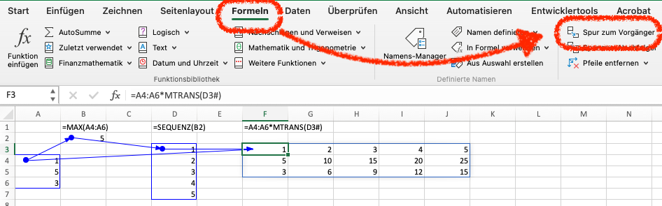
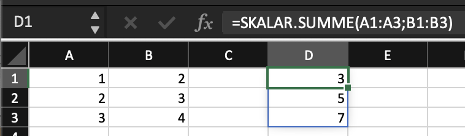

# Variablen, Funktionen und Operatoren {#sec-chapter-variablen-fkts-ops}

::: {.callout-warning}
## Work in Progress
:::

## Variablen

Excel kennt keine strikte Unterscheidung zwischen Konstanten und Variablen. Grundsätzlich sind alle Werte in Excel Konstanten, weil direkt eingegebene oder durch eine Formel erzeugte Werte nicht durch andere Formel verändert werden können.

::: {.callout-warning}
In Excel lassen sich Zellen und Bereiche *sperren*. Damit lassen sich die Werte wie Konstanten behandeln. Diese Sperre ist Teil der *Formatierung* einer Zelle und muss für das gesamte Arbeitsblatt festgelegt werden. Die Sperre kann nicht für einzelne Zellen oder Bereiche festgelegt werden.

Die Sperre eines Arbeitsblatts wird im Menuband `Überprüfen` mit dem Kommando `Blatt schützen` aktiviert. Richten Sie bei diesem Kommando  **kein** Passwort ein.
:::

Ist ein Arbeitsblatt gesperrt, sind die Werte auf diesem Arbeitsblatt unveränderlich und verhalten sich wie Konstanten. Ist ein Arbeitsblatt nicht gesperrt, dann verhalten sich die Werte wie Variablen.

### Dynamische Bereiche {#sec-dynamisches-feld}

Formeln können mehr als einen Wert verarbeiten und mehr als einen Ergebnis liefern. Solche Formeln müssen nur in die linke obere Ecke eines Bereichs eingetragen werden. Excel erkennt automatisch, dass die Formel auf einen Bereich angewendet werden soll und erzeugt die entsprechende Formel für alle Zellen des Bereichs. Das Ergebnis einer solchen Formel ist ein *dynamischer Bereich*.

::: {#def-vektorisieren}
**Vektorisieren** heisst das Erzeugen eines dynamischen Bereichs aus einem statischen Bereich.
:::

::: {#exm-vektorisieren}
## Vektorisieren eines statischen Bereichs

```
=A1:A10
```
:::

Im Gegensatz zu einem normalen Bereich, ist bei einem dynamischen Bereich nur die linke obere Zelle bekannt. Um trotzdem alle Zellen eines solchen Bereichs zu adressieren, wird die Gatter- (`#`) Notation verwendet.

Das @exm-vektorisieren erzeugt einen Bereich mit 10 Zellen. Die Formel wird in die linke obere Zelle des Bereichs eingetragen. Die Formel wird z.B. in die Zelle `B1` eingetragen. Anschliessend können die Werte im Bereich `B1:B10` über die Gatter-Notation addressiert werden: `B1#`.

Der Vorteil des Vektorisierens ist, dass der Bereich durch das Einfügen neuer Zeilen vergrössert werden kann, ohne dass die nachfolgenden vektorisierten Formeln angepasst werden müssen.

::: {.callout-tip}
## Praxis

Weil Tabellen automatisch vektorisiert werden, ist es einfacher Werte in einer Tabelle zu erfassen bzw. als Tabelle zu importieren (s. @sec-chapter-daten-importieren) und anschliessend über die Tabellenadressierung auf die Werte zu verweisen.
:::

::: {.callout-note}
## Merke
Tabellenadressierungen auf eine Spalte oder einen Spaltenberech sind immer Vektorisiert.
:::

> ::: {#exm-tabellen-zu-vektoren}
> ## Vektorisieren von Tabellenspalten
> 
> ```
> = Tabelle1[Spalte1]
> ```
> 
> Diese Formel vektorisiert die Spalte mit dem Namen `Spalte1` aus der Tabelle `Tabelle1`. Angenommen, dass diese Formel in Zelle `A1` des aktuellen Arbeitsblattes steht, dann kann anschliessend auf den Vektor über die Gatter-Notation zugegriffen werden: 
> 
> ```
> =A1#
> ```
> ::: 

### Benannte Bereiche

Im Funktionsbalken wird ganz links die Adresse der aktuellen Zelle angezeigt. Wenn in dieses Feld geklickt wird, dann kann der Adresse ein Name zugewiesen werden. Auf diese Weise kann eine Zelle oder ein Bereich benannt werden. Der Name eines Bereichs darf nur einmal in einer Arbeitsmappe existieren. Dafür kann in jeder Zelle der Arbeitsmappe dieser Namen als Adresse verwendet werden. Dazu ist es nicht notwendig, den die genaue Arbeitsblatt- und Zellenadresse zu kennen. 

Verweist ein benannter Bereich mit einer Zelle auf den Anfang eines dynamischen Bereichs, dann kann der gesamte dynamische Bereich mit der Gatter-Notation referenziert werden. 

Auf diese Weise lassen sich oft adressierte Zelleen oder Bereiche benennen. Dadurch kann die Adresse für Verwendung in Formeln abstrahiert werden. 

Die Verwendung von benannten Bereichen wird weiter vereinfacht, dass bei der Eingabe von Formeln die Namen der benannten Bereiche als Vorschlag angezeigt werden.

::: {#exm-dynamischer-benannter-bereich}
## Adressierung eines dynamischen benannten Bereichs
```
=umsatz#
```
::: 

Benannte Zellen helfen, auf wichtige Zellen in einer Arbeitsmappe zuzugreifen. 

::: {.callout-note}
## Merke
Ein benannter Bereich entspricht einer Variablen in anderen Programmiersprachen.
:::

::: {.callout-important}
Eine benannte Zelle oder ein benannter Bereich sind immer absolut referenziert.
:::

::: {.callout-note}
Wenn einem benannten Bereich Zellen hinzugefügt werden, dann wird der benannte Bereich um diese Zellen erweitert.
:::

::: {.callout-note}
Eine Tabelle ist ein spezieller benannter Bereich, der als Ganzes oder in Teilen referenziert werden kann (s. [Abschnitt @sec-tabellenadressen]).
:::

## Funktionen {#sec-funktionen}

Excel kann nur durch Funktionen und Operatoren *programmiert* werden. 

Excel hat wenige vordefinierte Operatoren, wobei die Operatoren keine direkte Entsprechung als Funktion haben. Die einzige Ausnahmen sind der Potenzoperator (`^`) und der Textverkettungsoperator (`&`). Der Potenzoperator ist funktional gleich mit der `POTENZ()`-Funktion. Der Textverkettungsoperator entspricht der Funktion `TEXTKETTE()` mit zwei Argumenten. 

::: {.callout-note}
## Merke
Die mit Excel möglichen Programme sind durch die Operatoren und die vordefinierten Funktionen beschränkt. 
:::

Excel **Kommandos** können nur durch Interaktion mit den Excel Menus oder Dialogen ausgeführt werden. Diese Funktionalität steht für die Progammierung oft nicht zur Verfügung.

::: {.callout-note}
## Makros
Neben den Funktionen und Kommandos existieren in Excel noch *Makros*. Mit Makros können neue Kommandos und Funktionen programmiert werden. Makros folgen aber nicht den Regeln von Formeln, weil sie in einer anderen Programmiersprache geschrieben werden.

Makros unterliegen nicht den Einschränkungen von Excel-Funktionen. Diese Freiheit ist gleichzeitig ein Fluch, denn Makros sind ein Sicherheitsrisiko und Excel präsentiert entsprechende Warnungen, wenn Makros in einer Arbeitsmappe gefunden wurde. 

Aktuelle Bestrebungen von Microsoft zielen darauf ab, Makros langfristig durch Funktionen zu ersetzen. Ein Teil dieser Bestrebungen ist die Einführung von `LAMBDA()`-Funktionen (s. [Abschnitt @sec-lambda-funktionen]).
:::

::: {.callout-note}
## Merke
Excel hat keine Identitätsfunktion. Die Identitätsfunktion wird durch eine Formel simuliert, die nur eine Adresse enthält. Solche Formeln werden für das *Vektorisieren* (@def-vektorisieren) von Bereichen eingesetzt.
:::

## Substitution

Excel kennt zwei Formen der Substitution. 

1. Die Substitution über Funktionspfade
2. Die Substitution mit der Funktion `LET()`

Beide Substitutionsformen sind fast gleichwertig. Funktionspfade eigenen sich besonders gut für die Entwicklung von und zur Fehlersuche in komplexen Formeln. `LET()` erlaubt es, mehrere Arbeitsschritte effizient in einer Formel zusammenzufassen.

### Substitution über Funktionspfade

Eine komplexe Operation lassen sich in Excel durch Substitution über Funktionspfade vereinfachen. 

::: {#def-funktionspfad}
Ein **Funktionspfad** sind Formeln, die sich über ihre Adressen aufeinander beziehen. 
:::

Bei einem Funktionspfad werden die substituierten Funktionen als Formeln in separate Zellen geschrieben. Die Adresse der jeweiligen Formel wird als Substitution für die Funktion eingesetzt. Sind die Formeln in einem benannten Bereich, dann kann der Name des Bereichs zur Substitution verwendet werden. 

{#fig-funktionspfad}

Funktionspfade können mithilfe des Kommandos `Spur zum Vorgänger` im Menü `Formeln` sichtbar gemacht werden (@fig-funktionspfad).

::: {.callout-tip}
## Praxis
Um komplexe Formeln in bestehenden Arbeitsmappen zu verstehen, hilft das Zerlegen dieser Formeln in Funktionspfade. Dabei kann eine tabellarische Organisation helfen, wiederkehrende Operationen leichter zu erkennen. 
:::

### Substitution mit `LET()`

Excels `LET()`-Funktion erlaubt das Vereinfachen komplizierter Formeln durch *Variablen*. Diese *Variablen* existieren nur im Kontext der `LET()`-Funktion und können nicht ausserhalb dieser Funktion verwendet werden.

Eine Variable in der `LET()`-Funktion entspricht einer Substitution eines Teilausdrucks einer Formel.

::: {#exm-let-substitution}
## `LET()`-Funktion zur Substitution
```Excel
=LET(
    Daten; 'Unbearbeitete Daten'!A:F;
    DatenFeld; INDEX(
        Daten;
        sequenz(ZEILEN(Daten));
        sequenz(1; SPALTEN(Daten))
      ); 
    WENN(ISTLEER(DatenFeld);#NV;DatenFeld)
 )
```
::: 

In @exm-let-substitution wird der referenzierte Bereich und der Aufruf der `INDEX()` substituiert. Die Substitution wird durch die Variablen `Daten` und `DatenFeld` realisiert. 


::: {#exm-ohne-let-substitution}
## Formel ohne Substitution

```
=WENN(ISTLEER(INDEX(
        'Unbearbeitete Daten'!A:F;
        sequenz(ZEILEN('Unbearbeitete Daten'!A:F));
        sequenz(1; SPALTEN('Unbearbeitete Daten'!A:F))
      ));
      #NV;
      INDEX(
        'Unbearbeitete Daten'!A:F;
        sequenz(ZEILEN('Unbearbeitete Daten'!A:F));
        sequenz(1; SPALTEN('Unbearbeitete Daten'!A:F))
      )
 )
 ```
:::

Die beiden Beispiele veranschaulichen, wie mit der `LET()`-Funktion mehr als eine Substitution umgesetzt wird, um eine komplexe Formel in überschaubare Teilschritte zu zerlegen und so stark zu vereinfachen.

::: {.callout-tip}
## Praxis
Wird eine Funktion in einer Formel mit den gleichen Parametern mehrfach aufgerufen, dann sollte diese Funktion **immer** mit `LET()` substituiert werden. Substituierte Berechnungen werden nur einmal für die Substitution durchgeführt und anschliessend wird nur das Ergebnis verwendet. Nicht substituierte Funktionen werden bei jedem Vorkommen neu ausgeführt. 
:::

## Funktionsketten

Funktionsketten werden in Excel über Substitutionen erzeugt. Gerade bei Matrizen und anderer Transformationen von Datenstrukturen ist die Verwendung von Funktionspfaden aus zwei Gründen unhandlich: 

1. Wenn die Ergebnisse mehrerer Arbeistsschritte auf einem Arbeitsblatt dargestellt werden, wird  die Übersichtlichkeit behindert.
2. Weil Funktionspfade separate Formeln verwenden werden die Ergebnisse für jede Formel serialisiert, was nicht immer zu den erwarteten Ergebnissen führt.

Weil Excel keine Operatoren für die Funktionsverkettung bereitstellt, werden Funktionsketten **immer** mithilfe der Funktion `LET()` erzeugt. 

<!-- 
### LET() und leere Zellen {#sec-funktionsketten-leerezelle}
-->
Normalerweise werden leere Zellen als Ergebnis einer Funktion durch `0` ersetzt. Dieses Konvertierung findet erst bei der Darstellung des Ergebnisses statt. Innerhalb einer Funktionskette werden leere Zellen als leere Zellen weitergereicht, solange keine Aggregation vorgenommen wird. Es ist deshalb möglich in einer Funktionskette eine Entscheidung mit `ISTLEER()` für den Fall einer leeren Zelle zu treffen.

Eine Excel-Operation **muss** einen Wert als Ergebnis einer **Formel** haben. Wird ein nicht vorhandener Wert (d.h. leere Zelle) in einem Ergebnis einer Formel gefunden, dann wird dieser Wert automatisch in den Wert `0` konvertiert. Diese Umwandlung passiert jedoch erst *nachdem* die Operation abgeschlossen ist und Excel das Ergebnis auf dem Arbeitsblatt darstellt. 

Dieses Verhalten hat zur Folge, dass solange eine Operation nicht abgeschlossen ist, die nicht vorhandenen Werte in ihrer ursprünglichen Form erhalten bleiben. Es ist also möglich undefinierte Werte mit `ISTLEER()` zu prüfen. 

Die ursprünglichen Daten können unvollständig sein und enthalten dann leere Zellen an den entsprechenden Zellen. Diese fehlenden Werte als `0` darzustellen, kann zu verzerrten Ergebnissen führen. Deshalb sollten solche Werte mit dem *Fehler* `#NV` (lies: *Nicht Vorhanden*) markiert werden. Dieser Fehlerwert wird nicht automatisch in den Wert `0` umgewandelt, so dass die fehlenden Werte korrekt berücksichtigt werden können. 

Diese Umwandlung nutzt aus, dass Excel leere Zellen als Ergebnis von *Funktionen* zulässt, aber nicht als Ergebnis von *Formeln*. Entsprechend kann das folgende Funktionsmuster verwendet werden.


Die beiden Vektoren `G1#` und `H1#` sind Hilfsvektoren, die Sequenzen für die Zeilen- und Spaltenindizes der Datenstruktur `A:F` enthalten.

Der *logische Ausdruck* prüft, ob ein Feld mit dem Index `G1#` und `H1#` im Stichprobenobjekt leer ist. Falls das Feld in den unbearbeiteten Daten leer ist, dann wird der Wert `#NV` als Ergebnis zurückgegeben. Sonst soll der Wert im Feld übergeben. 

In dieser Operation wird die Funktion `INDEX()` zwei Mal mit den gleichen Parametern aufgerufen. Das ist unpraktisch, weil die Operation an zwei Stellen angepasst müsste, wenn die Daten mehr oder weniger Spalten haben. Besser wäre es, wenn das Zwischenergebnis der `INDEX()`-Funktion aus der Operation herausgelöst wird und über eine Funktionsverkettung eingebunden wird. Das ist aber nicht möglich, weil Excel bei diesem Zwischenschritt die fehlenden Werte in `0` ändert, sodass anschliessend der logische Ausdruck immer `FALSCH` liefern würde.

Mittels der `LET()` Funktion wird das Ergebnis dieses Zwischenschritts in einer temporären *Variablen* gespeichert. Gegenüber der normalen Funktionsverkettung durch Funktionspfade hat diese Strategie den Vorteil, dass für Excel die Operation nicht abgeschlossen ist und deshalb die fehlenden Werte *noch nicht* in den Wert `0` umgewandelt werden. Der logische Ausdruck in der `WENN()`-Funktion kann also `WAHR` ergeben, wenn in den Daten ein Wert fehlt. Ausserdem muss die Indizierung für eine Position nur einmal durchgeführt werden, was bei komplexen Formeln die Übersichtlichkeit erhöht und die Ausführung beschleunigt.

Die ursprüngliche Formel lässt sich also dahingehend vereinfachen, dass der Aufruf der `INDEX()`-Funktion "ausgeklammert" und in der Hilfsvariablen `Feld` gespeichert wird. 

Daraus ergibt sich die Lösung als Funktionskette.

```
=LET(Feld; INDEX('Unbearbeitete Daten'!A:F;A2#;B1#); 
     WENN(
        ISTLEER(Feld);
        #NV;
        Feld
     )
 )
```

Diese Lösung entspricht ungefähr der Funktionskette @eq-funktionskette-let.

$$
Index() \triangleright Wenn()
$$ {#eq-funktionskette-let}

Damit wird der Aufruf der `WENN()`-Funktion vereinfacht, weil nur noch die Hilfsvariable `Feld` übergeben müssen. Diese Variable enthält die Daten für die Funktionsverkettung, so dass eine zusätzliche Arbeitsblattadresse nicht notwendig ist. 

## Funktionen selbst definieren {#sec-lambda-funktionen}

In Excel können eigene Funktionen mit der Funktion `LAMBDA()` erzeugt werden. Die `LAMBDA()`-Funktion erzeugt die Funktion aus ihren Parametern. Dabei ist der letzte Parameter immer der Funktionskörper. Die restlichen Parameter sind die Parameter der Funktion. Es können max 253 Parameter angegeben werden, wobei keine optionalen oder vorbelegten Parameter möglich sind. @exm-lambda-basic zeigt eine einfache Funktionsdefinition mit zwei Parametern.

::: {#exm-lambda-basic}
## Funktionsdefinition mit zwei Parametern ohne Ausführung
```excel
= LAMBDA(a; b; a + b)
```
:::

::: {.callout-warning}
Mit Excels `LAMBDA()`-Funktion können nur Funktionen durch Verkettung anderer Funktionen erzeugt werden. 
:::

Für Excel sind Funktionen kein darstellbarer Datentyp. Wird also eine Funktion mit `LAMBDA()` definiert, ohne dass sie unmittelbar ausgeführt wird, zeigt Excel den Fehler  `#KALK!` an. Dieser Fehler kann dadurch vermieden werden, indem die Funktion unmittelbar ausgeführt wird (s. @exm-lambda-basic-run).


::: {#exm-lambda-basic-run}
## Funktionsdefinition mit zwei Parametern mit sofortiger Ausführung
```excel
= LAMBDA(a; b; a + b)(1;2)
```
:::

::: {.callout-warning}
Der Funktionskörper muss nicht alle Parameter verwenden. Wird eine Funktion aufgerufen, dann **müssen** alle Parameter angegeben werden, selbst wenn diese im Funktionskörper nicht verwendet werden.
::: 

### Map-Reduce und `LAMBDA()`

Weil eine mit `LAMBDA()` erzeugte Funktion als Formel direkt ausgeführt werden muss, ergibt sich kein Vorteil gegenüber normalen Excel-Formeln. Die Funktion wird jedoch zum Erstellen von Callbacks benötigt. Die Hauptanwendung sind Operationen, die mit jedem Wert eines Bereichs durchgeführt werden sollen. Weil Excel normalerweise keine Schleifen zulässt, müssen solche Operationen über die Logikfunktionen `MAP()`, `NACHZEILE()`, `NACHSPALTE()`, `REDUCE()` und `SCAN()` erzeugt werden.

Alle Map-Funktionen erwarten als ersten Parameter einen Bereich mit Werten und als letzten Parameter eine Funktionsdefinition mit `LAMBDA()`.

- `MAP()` erzeugt eine Schleife, welche den Callback für jedes Element genau einmal aufruft. Es ist möglich, mehrere Bereiche anzugeben. Die Parameteranzahl der Callback muss der Anzahl der angegebenen Bereiche entsprechen. 

- `NACHSPALTE()` erzeugt eine Schleife, die eine Funktion für jede Spalte eines Bereichs aufruft. Der Callback darf nur einen Parameter haben. Der Parameter enthält eine Liste mit allen Werten der aktuellen Zeile.

- `NACHZEILE()` erzeugt eine Schleife, die eine Funktion für jede Zeile eines Bereichs aufruft. Der Callback darf nur einen Parameter haben.

`MAP()`, `NACHSPALTE()` und `NACHZEILE()` behandeln die einzelnen Durchläufe der Schleife als *unabhängig*. Im Gegensatz dazu sind die Durchläufe einer `REDUCE()` oder `SCAN()`-Schleife immer vom voherigen Durchlauf *abhängig*. `REDUCE()` und `SCAN()` erfordern als ersten Parameter einen Initialwert, der als Argument für den ersten Aufruf des Callbacks verwendet wird. 

- `REDUCE()` erzeugt eine Schleife, die für jedes Element eines Bereichs den Callback ausführt. Diese Funktion erhält als ersten Parameter, das  Callback-Ergebnis des vorherigen Durchlaufs und als zweiten Parameter. Das Ergebnis von `REDUCE()` ist das Ergebnis des letzten Aufrufs der Schleifenfunktion. 

- `SCAN()` ist eine Variante von `REDUCE()`. Während `REDUCE()` nur das letzte Ergebnis der Callbacks ausgibt, erzeugt `SCAN()` einen Vektor mit allen Ergebnissen der Callback-Aufrufe. 

::: {.callout-warning}
Die Map-Reduce-Funktionen dürfen nur einzelne Werte erzeugen. Datenstrukturen sind auch dann nicht erlaubt, wenn sie alle die gleiche Länge haben und sich in einen rechteckigen Bereich zusammenfügen liessen. Diese Beschränkung gilt auch, wenn die Funktionsergebnisse als Zwischenschritt an eine Kombinationsfunktion für Vektoren (z.B. `VSTAPELN()`) verknüpft werden. Erzeugt ein Callback eine Datenstruktur, dann erzeugt die jeweilige Funktion den Fehlerwert `#KALK!`.

Einzig die Funktion `REDUCE()` darf Datenstrukturen erzeugen; weil diese Funktion nur ein Ergebnis haben kann.

Diese Einschränkung bedeutet, dass die Funktionen `NACHSPALTE()` und `NACHZEILE()` die Identitätsfunktion **nicht** als Callback akzeptieren.
::: 

### Index-Schleifen mit `MATRIXERSTELLEN()`

Während die Funktionen der Map-Reduce-Familie Werte voraussetzen, ist dies nicht immer möglich. Die Funktion `MATRIXERSTELLEN()` erzeugt eine Schleife über zwei Iteratoren, für die Dimensionen der gewünschten  Matrix. Der Callback für die Funktion erfordert deshalb 2 Parameter für die beiden Indizes.   

::: {.callout-tip}
## Praxis
Die Funktion `MATRIXERSTELLEN()` kann meistens durch das ***äussere Produkt*** (@sec-chapter-matrix-operationen) ersetzt werden. 
:::

Der Callback für `MATRIXERSTELLEN()` darf nur zwei Parameter haben, denen die aktuellen Index-Werte zugewiesen werden. Daraus ergibt sich, dass im Funktionskörper nur diese beiden Parameter bereitgestellt werden. Komplexere Anwendungen lassen sich mit *Closures* erzeugen. Dazu wird eine Funktion mit LAMBDA() erzeugt, die zusätzliche Werte oder Datenstrukturen als Parameter unterstützt. Diese Funktion erzeugt anschliessend den Callback für `MATRIXERZEUGEN()`. Der Callback ist also ein Closure der erzeugenden Funktion. Dadurch kann der Callback die Werte und Datenstrukturen der erzeugenden Funktion beim Aufruf durch die Funktion `MATRIXERZEUGEN()` ebenfalls verwenden (s. @exm-matrixerstellen-mit-closure). 

::: {#exm-matrixerstellen-mit-closure}
## Matrix mit Closure erstellen
Im Bereich `A1:A4` stehen beliebige Zeichenketten.

```
=MATRIXERSTELLEN(5;3;
    LAMBDA(namen;
           LAMBDA(a;b; 
                  ZEILENWAHL(namen; 
                             REST(a+b; 
                                  ZEILEN(namen))+1)
           )
    )(A1:A4)
 )
```
:::

### Neue Funktionen festlegen

Neben Schleifen können mit `LAMBDA()` neue Funktionen erzeugt werden. Dazu muss in einem Arbeitsblatt ein Name mit der Funktionsdefinition erzeugt werden. Namen werden über das Menüband `Formeln` mit dem Kommando `Namen definieren` erzeugt. Dieses Kommando öffnet einen Dialog, über welchen ein Name definiert werden kann(@fig-lambda-funcdef). In diesem Dialog müssen die beiden Felder `Name` und `Bezieht sich auf` ausgefüllt werden. 

Der `Name` ist der Bezeichner der neuen Funktion. Hier dürfen keine Namen vorhandener Funktionen oder benannter Bereiche verwendet werden. Das Feld `Bezieht sich auf` muss eine LAMBDA-Formel mit der Funktionsdefinition beinhalten. Als `Bereich` sollte immer `Arbeitsmappe` ausgewählt sein, weil sonst die Funktion auf ein einziges Arbeitsblatt beschränkt wäre. Zur Dokumentation sollte im Feld `Kommentar` zusätzlich eine Kurzbeschreibung der Funktion angegeben werden. Leider zeigt Excel diesen Kommentar nicht als Kurzhilfe für den Funktionsnamen an.

{#fig-lambda-funcdef}

Nachdem eine Funktion einem Namen zugewiesen wurde, kann dieser Name wie jede andere Funktion in Formeln verwendet werden (@fig-call-own-function).

{#fig-call-own-function}

Als Funktionskörper können beliebige Excel Operationen vorkommen. Es bietet sich jedoch an, für komplexere Funktionen den Funktionskörper mit `LET()` einzuleiten. Dadurch lassen sich einzelne Arbeitsschritte leichter isolieren und verketten.
